# 从零读懂 OCULUS：Three.js 与眼球模型图文教程

> 面向没有 Three.js 基础的学习者。重点是**三维场景、模型、材质、剖切、拾取、动画与资源管理**；HTML/CSS 只作必要定位，不展开前端基础课程。
>
> 源码基线：`db49946`；核对与配图日期：**2026-09-21**。本地安装版本为 Three.js **0.186.0（r186）**、Vite **8.3.0**、Node.js **22.22.0**。这里讲的是当前项目，不是任意版本 Three.js 的通用模板。
>
> 这是技术示意模型，不是经过医学审核的数字人体。文中的结构名称用于说明代码关联，不构成诊断、临床教学或测量依据。

## 如何使用这份教程

第一次阅读，按第 1～10 节建立“文件 → 场景 → 一帧画面”的认识，再阅读交互与导入。第二次打开源码，对照第 6～16 节逐个函数阅读。想动手时，先做第 4 节的独立小例子，再做第 18 节练习。

本文区分三种代码：

- **源码摘录**：来自标明的文件，依赖该文件上下文，不应单独粘贴运行。
- **教学简化**：为解释概念省略页面业务，不是用于替换项目源码的补丁。
- **可运行练习**：注明文件位置和操作步骤，放在忽略的练习目录，不覆盖 `src/` 或默认模型。

代码截图保留源码行号，长行只做视觉折行；旁边有可复制片段。后续源码变动时，优先搜索函数名，不把历史行号当成永久定位。所有配图使用本地文件，不依赖 Mermaid 或在线图床。

## 目录

1. [先认识最终效果](#result)
2. [运行项目：开发、构建、预览](#run)
3. [项目地图：每个文件负责什么](#files)
4. [Three.js 基础与第一个可运行场景](#first-scene)
5. [从 HTML 执行到第一帧](#startup)
6. [模型对象与默认 GLB 加载](#model)
7. [Viewer：相机、材质、光照与环境](#viewer)
8. [相机交互、坐标与自适应尺寸](#camera)
9. [渲染循环与性能数字](#loop)
10. [重点：三轴剖切与交并集](#clipping)
11. [展示模式、透明度与线框](#display)
12. [重点：拾取、高亮与图文联动](#selection)
13. [重点：三维标注如何贴在页面上](#annotations)
14. [重点：导入 GLB、glTF、OBJ](#import)
15. [重点：动画、替换与资源释放](#lifecycle)
16. [眼球如何制作：几何、纹理与导出](#generation)
17. [页面与辅助功能速览](#page)
18. [从零搭建路线与动手练习](#practice)
19. [测试、排错与部署](#verification)
20. [完整覆盖索引、配图来源与参考](#index)

---

<a id="result"></a>
## 1. 先认识最终效果

这是一个纯前端眼球解剖展示程序：**浏览器读取 GLB 文件，Three.js 绘制眼球，原生控件修改三维状态，再由渲染循环画出变化。**没有后端、数据库、登录或模型上传服务。

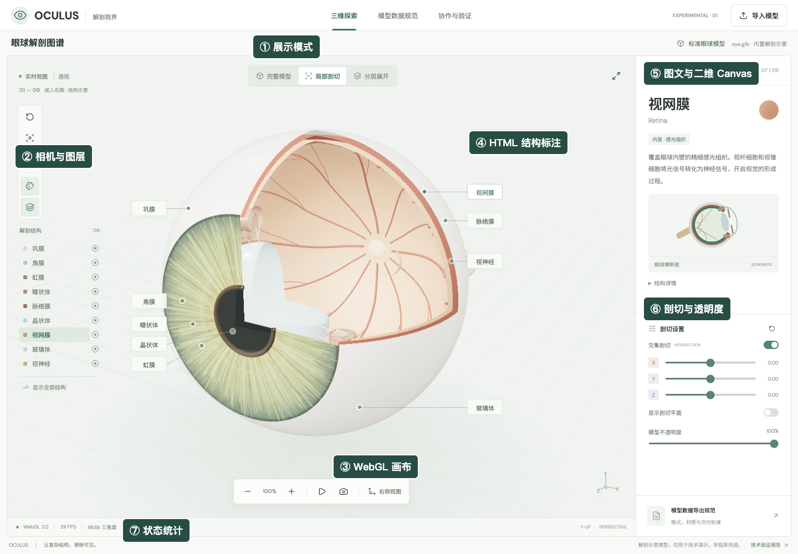

*图 1：本次运行的桌面总览，编号说明为教学后加的覆盖层，不是产品按钮。模型区是 WebGL Canvas；标签、按钮与右侧信息是 HTML。*

先做这几个操作，再读代码，效果更容易对应：

| 操作 | 观察什么 | 后面对应的概念 |
| --- | --- | --- |
| 左键拖动、滚轮缩放、右键拖动 | 观察角度、距离与中心改变 | 相机、OrbitControls |
| 完整模型 → 局部剖切 → 分层展开 | 同一份模型出现三种展示方式 | 材质裁剪、Group 位移 |
| 拖动 X 轴滑块，关闭交集剖切 | 缺口大小、形状变化 | Plane 方程、交集与并集 |
| 点击“虹膜”，关闭“显示巩膜” | 高亮、文字、二维示意图与图层状态改变 | id、emissive、visible |
| 改不透明度、切线框 | 表面表现改变，模型没有重新加载 | Material |
| 点击保存模型截图 | 下载的是模型 Canvas，不包含工具栏 | Canvas 输出边界 |

项目有**两种用途不同的 Canvas**：

1. `#scene` 内由 `WebGLRenderer` 创建的 Canvas：三维眼球、网格、示意阴影。
2. `#anatomy-diagram`：`drawDiagram()` 用 Canvas 2D 手工画的固定示意图。

第二种不是第一种的截屏，也不是根据滑块自动生成的切面图。外部模型导入后，固定二维图会隐藏，避免用眼球示意图解释未知模型。

<a id="run"></a>
## 2. 运行项目：开发、构建、预览

### 2.1 第一次启动

在项目根目录执行：

```bash
npm ci
npm run dev -- --host 127.0.0.1 --port 5188 --strictPort
```

打开 `http://127.0.0.1:5188/`，保持该终端运行。需要支持 **WebGL 2** 的现代浏览器和可用的图形环境。Node.js 用于开发工具，不负责在服务器上渲染眼球。项目 README 要求 Node.js 22.12+，本次用 22.22.0 验证。

`npm ci` 按 lockfile 重建依赖；不需要每次启动都执行。5188 被占用时，确认是不是当前项目已经启动；否则换成 5189，并同步测试的 `BASE_URL`。不要结束不认识的进程。

### 2.2 三个容易混淆的命令

| 命令 | 做什么 | 不做什么 |
| --- | --- | --- |
| `npm run dev` | 提供开发服务，处理模块导入和 CSS，支持热更新 | 不发布到互联网 |
| `npm run build` | 将源码打包到 `dist/`，复制 `public/` 资源 | 不证明所有交互正确 |
| `npm run preview` | 本地服务化浏览构建产物 | 不是源码热更新服务 |

不能双击 `index.html` 用 `file://` 打开：`import 'three'`、模块资源与 GLB 路径都需要开发或静态服务处理。

### 2.3 依赖只记住这些角色

| 依赖 | 当前用途 |
| --- | --- |
| `three` | 场景对象、渲染器、几何、材质、Loader、Controls、动画 |
| `lucide` | HTML 工具按钮里的 SVG 图标，不是三维模型 |
| `marked` | 将项目自带 Markdown 转为 HTML |
| `vite` | 开发服务、打包与预览 |
| `playwright` | 自动操作真实浏览器并验证页面 |
| `gltf-validator` | 校验 GLB/glTF 格式，不判断医学准确性 |

`package.json` 的 `^` 是版本范围；`package-lock.json` 记录本次可重现安装的依赖树。不要因为教程里出现某个版本就另外安装一套依赖。Three.js addons 来自已经安装的 `three`，不需要单独装一个“OrbitControls 包”。

<a id="files"></a>
## 3. 项目地图：每个文件负责什么

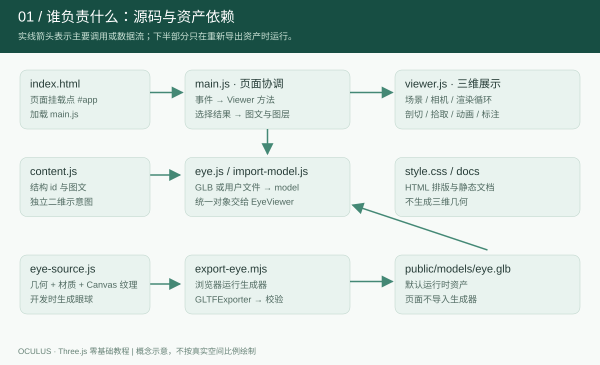

*图 2：上方是页面运行链路，下方是离线制作 GLB 的链路。默认页面加载 GLB，不调用 `createEye()`。*

```text
Visual3D/
├── index.html                     页面入口
├── package.json / package-lock.json
├── src/
│   ├── main.js                    页面协调、事件和回调
│   ├── viewer.js                  Three.js 展示与交互核心
│   ├── eye.js                     默认 GLB、锚点与模型释放
│   ├── import-model.js            外部模型适配
│   ├── content.js                 结构信息与二维示意图
│   └── style.css                  页面布局，非三维材质
├── public/
│   ├── models/eye.glb             默认模型资产
│   └── docs/                      本教程、交付文档与配图
├── scripts/
│   ├── eye-source.js              眼球程序化生成器
│   ├── export-eye.mjs             导出默认 GLB（会覆盖资产）
│   ├── check.mjs                  Node 逻辑与资产校验
│   ├── browser-check.mjs          开发态浏览器回归
│   └── deploy-check.mjs           构建产物检查
├── .github/workflows/deploy.yml   GitHub Pages 构建部署
├── .gitignore
└── README.md
```

### 3.1 六个源码文件的编写方式

| 文件 | 输入 → 输出 | 实现方式与设计目的 |
| --- | --- | --- |
| `main.js` | DOM 事件、模型与回调 → 控件/文字状态 | 先建立界面再绑定事件；将选择集中到 `selectPart()`，不在每个入口重复图文更新 |
| `viewer.js` | 容器、model、回调 → WebGL 帧与选择/统计通知 | 一个 `EyeViewer` 管理场景与长期对象，方法更新状态，循环持续绘制 |
| `eye.js` | GLB URL → 内置 model；model → 资源清理 | 按命名约定验证九组结构，集中锚点数据和释放逻辑 |
| `import-model.js` | FileList → 外部 model，失败抛 Error | 解析格式差异后统一返回结构；不直接删除旧模型或更新页面 |
| `content.js` | 结构 id → 数据；Canvas + id → 二维图 | 静态数组与绘图函数；不负责生成三维眼球 |
| `style.css` | HTML 结构与状态类 → 页面排版 | 只控制布局、叠层和响应式，不改变 Geometry 或 Material |

这是简单的职责划分，不是复杂框架。`main.js` 可以调用 Viewer，Viewer 通过回调通知页面，不需要知道“说明文字应该放在哪个侧栏”。

### 3.2 必须分清运行环境

- `src/` 的页面逻辑运行在浏览器；`document`、Canvas、File 和 WebGL 都来自浏览器。
- 测试和导出 `.mjs` 脚本由 Node 执行，但 `page.evaluate(...)` 里的函数切到浏览器执行。
- `eye-source.js` 虽然放在 `scripts/`，仍需要浏览器 Canvas，不能仅用 `node` 就完成模型纹理生成。
- `check.mjs` 导入 `EyeViewer`，但不实例化它，因此没有执行依赖 DOM/WebGL 的构造函数。

`node_modules/` 是第三方实现；`dist/` 是构建结果；`test-results/` 是生成的测试资产、图片和报告；`.understand-anything/` 是可再生架构分析缓存。它们都不是阅读业务代码的起点，也不是需要逐文件手改的源码。

<a id="first-scene"></a>
## 4. Three.js 基础与第一个可运行场景

### 4.1 把三维渲染理解成拍摄

| 概念 | 通俗理解 | 项目中的实际对象 |
| --- | --- | --- |
| `Scene` | 装道具和灯光的舞台 | 眼球、辅助网格、灯光所在的根容器 |
| `Geometry` | 形状的顶点、三角形和属性 | 球壳、圆环、血管细管 |
| `Material` | 表面如何回应光照 | 颜色、粗糙度、透明度、剖切设置 |
| `Mesh` | 有形状也有表面的可绘制道具 | 一个球壳或晶状体网格 |
| `Group` | 能一起移动的一组道具 | 巩膜组、虹膜组，以及模型总根节点 |
| `Texture` | 贴在表面的图片数据 | 虹膜纤维与巩膜血丝颜色图 |
| `Camera` | 从哪里、以多大视野观察 | 当前的透视相机 |
| `WebGLRenderer` | 把舞台和镜头变成像素的绘制器 | 在 Canvas 中提交 GPU 绘制 |
| `OrbitControls` | 控制镜头的旋转、平移与距离 | 左键拖动、滚轮和右键操作 |

最重要的关系：

```js
const mesh = new THREE.Mesh(geometry, material);
scene.add(mesh);
renderer.render(scene, camera);
```

`scene.add()` 只是建立对象关系，**不是立即画图**。只有调用渲染器时，对象才会成为屏幕像素。相机不需要作为子对象添加到 Scene，便可传给 `render()` 使用。

### 4.2 先画一个小球，不直接复制整个项目

**可运行练习**：在本仓库忽略的目录 `test-results/learning-first-frame/` 新建 `index.html`，粘贴下面完整内容。使用第 2 节已经启动的开发服务，访问：

```text
http://127.0.0.1:5188/test-results/learning-first-frame/index.html
```

它复用当前项目安装的 Three.js，不新增包，不覆盖业务文件。下面只有建立画布所需的最少 HTML/CSS。

```html
<!doctype html>
<html lang="zh-CN">
<meta charset="UTF-8">
<meta name="viewport" content="width=device-width, initial-scale=1">
<title>Three.js 第一帧练习</title>
<style>body { margin: 0; } #scene { width: 100vw; height: 100vh; }</style>
<div id="scene"></div>
<script type="module">
import * as THREE from 'three';
import { OrbitControls } from 'three/addons/controls/OrbitControls.js';

const container = document.querySelector('#scene');
const scene = new THREE.Scene();
scene.background = new THREE.Color('#edf3ef');
const camera = new THREE.PerspectiveCamera(36, 1, 0.1, 100);
camera.position.set(3, 2, 5);
const renderer = new THREE.WebGLRenderer({ antialias: true });
renderer.setPixelRatio(Math.min(devicePixelRatio, 2));
container.append(renderer.domElement);
const controls = new OrbitControls(camera, renderer.domElement);
controls.enableDamping = true;

scene.add(new THREE.HemisphereLight('#ffffff', '#657767', 2));
const light = new THREE.DirectionalLight('#ffffff', 3);
light.position.set(3, 5, 4);
scene.add(light);
const geometry = new THREE.SphereGeometry(1, 32, 24);
const material = new THREE.MeshStandardMaterial({ color: '#6cae99', roughness: 0.4 });
const mesh = new THREE.Mesh(geometry, material);
scene.add(mesh);

const resizeObserver = new ResizeObserver(() => {
  const { width, height } = container.getBoundingClientRect();
  camera.aspect = width / height;
  camera.updateProjectionMatrix();
  renderer.setSize(width, height);
});
resizeObserver.observe(container);
renderer.setAnimationLoop(() => {
  controls.update();
  renderer.render(scene, camera);
});
</script>
</html>
```

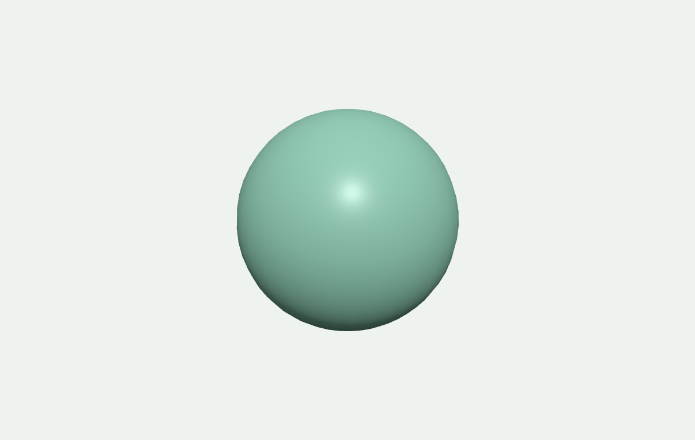

*图 3：该完整例子在本次隔离练习目录中实际运行的结果。拖动可旋转观察，缩放会改变球体在画面中的大小。*

按执行目的理解，而不是背构造函数：

1. 创建容器、Scene 和 Camera：确定“放在哪里、看向哪里”。
2. 创建 Renderer 并挂入 DOM：让 GPU 输出有一个可见的 Canvas。
3. 增加灯光：Standard 材质需要光照；没有光，模型可能很暗。
4. `Geometry + Material` 组成 Mesh，再加入 Scene。
5. 监听容器尺寸，更新相机投影与绘图缓冲区，避免画面拉伸。
6. 每帧更新 Controls，再 render；阻尼才会在松开鼠标后逐渐停止。

此练习刻意不含剖切、GLB、图层和标注。先确认这条最小链路，再增加功能。当前项目后续只是把小球换成一棵更复杂的模型树，并为它添加控制方式。

### 4.3 本项目必需的几条 JavaScript 知识

- `import/export`：连接文件。例如 `loadEye` 是命名导出，需要 `import { loadEye }`。
- `await`：等异步结果可用后继续当前函数，不是把整个浏览器卡住。
- `Map`：用结构 id 找到 Three.js 对象；`Set`：释放时对共享材质/纹理去重。
- 回调：把 `selectPart` 传入 Viewer，点击模型时再调用它。
- 对象引用：材质引用同一个 Plane，所以修改 `constant` 能被下一帧读取。

掌握这些就够开始读 Three.js 主线，无需先学完整前端框架。

<a id="startup"></a>
## 5. 从 HTML 执行到第一帧

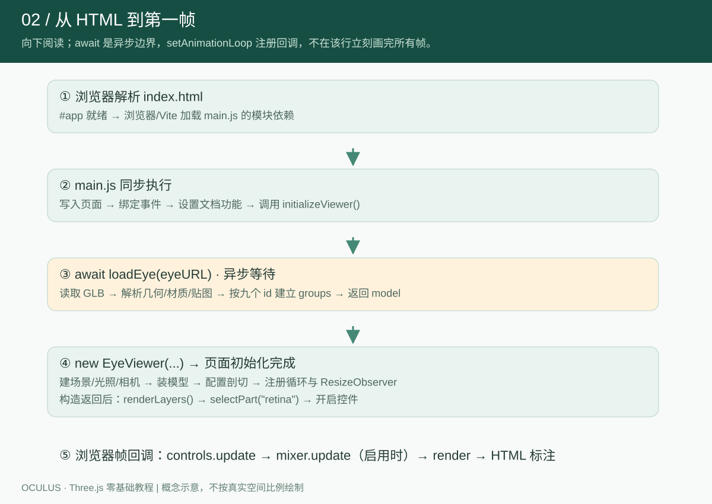

*图 4：特别注意第 ③ 步的异步边界和第 ⑤ 步的浏览器帧回调，不能把整个流程当作一段同步代码。*

### 5.1 同步准备：入口和页面

`index.html` 的核心只有挂载点 `#app` 与 `/src/main.js` 的 module 脚本。Vite 处理 CSS、npm 包与 ES Modules。浏览器先加载并执行依赖模块，再执行 `main.js` 的模块主体。

`main.js` 按这个顺序工作：

1. 导入 Three.js 功能模块、图文、图标和 Markdown 工具。
2. 用受控模板写入页面；此时 `#scene`、按钮、侧栏都已存在。
3. 替换图标占位，定义页面函数，绑定各类事件。
4. 配置文档弹窗与详情折叠。
5. 文件最后调用 `initializeViewer()`。

定义 `EyeViewer` 类并不等于已经创建 Viewer；绑定事件也不等于已经执行事件处理函数。

### 5.2 异步读取与连接回调

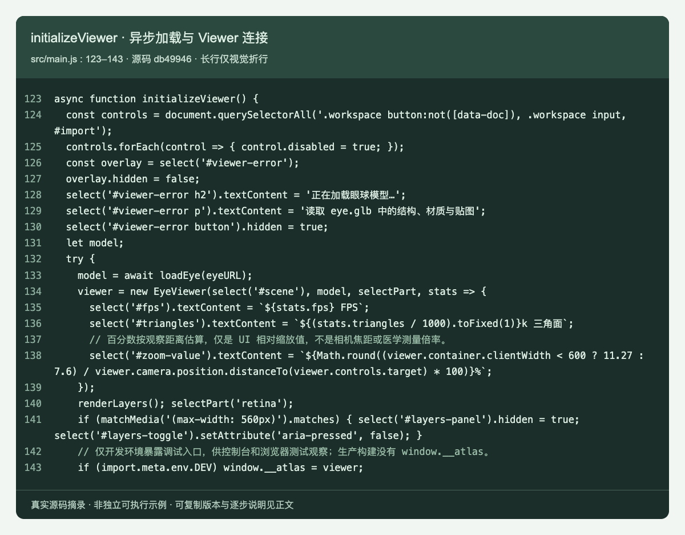

*图 5：`src/main.js` 的初始化片段。先禁用依赖模型的控件，再等模型可用。*

下面是其中关键的**源码摘录**：

```js
model = await loadEye(eyeURL);
viewer = new EyeViewer(select('#scene'), model, selectPart, stats => {
  select('#fps').textContent = `${stats.fps} FPS`;
  select('#triangles').textContent = `${(stats.triangles / 1000).toFixed(1)}k 三角面`;
  select('#zoom-value').textContent = `${Math.round((viewer.container.clientWidth < 600 ? 11.27 : 7.6) / viewer.camera.position.distanceTo(viewer.controls.target) * 100)}%`;
});
renderLayers(); selectPart('retina');
```

- `eyeURL` 由 `import.meta.env.BASE_URL + 'models/eye.glb'` 组成，本地和子目录部署使用不同前缀。
- `loadEye()` 完成后，`model` 才包含真正的 Three.js 对象，不能只传一个文件名给 Viewer。
- 第三个参数是选中结构后的回调，第四个参数是统计回调。后者并不是构造时立刻读取 `viewer`，而是之后由帧统计触发。
- 构造函数返回后重建图层，默认选中视网膜，恢复控件可用性，隐藏加载覆盖层。
- 开发模式才挂载 `window.__atlas = viewer`；生产 preview 不保证存在这个调试入口。

### 5.3 第一帧究竟在哪里画

`EyeViewer` 构造函数建立场景、相机、环境、模型与事件，并用 `setAnimationLoop()` 注册循环。注册不是同步执行所有帧：实际渲染在浏览器后续帧回调里调用 `renderer.render(scene, camera)`。

`ResizeObserver` 在浏览器安排的回调中同步容器宽高、相机比例和 Canvas 尺寸。这与构造函数、页面事件属于协作关系，不应描述成“GLB 请求一返回就已完成最终屏幕绘制”。

加载失败时显示错误和重新加载入口，没有偷偷调用程序化生成器作为备用模型。WebGL 初始化失败与文件加载失败也显示不同原因。独立文档入口仍可用。

<a id="model"></a>
## 6. 模型对象与默认 GLB 加载

### 6.1 `model` 不是 Three.js 内置类型

`loadEye()` 和 `loadModel()` 返回的是项目自己约定的普通对象，将不同模型统一交给 Viewer：

| 字段 | 内容 | 使用者与目的 |
| --- | --- | --- |
| `root` | 展示用根 Object3D/Group | 加入 Scene、移除、遍历释放 |
| `groups` | `Map<id, Group 或 Mesh>` | 图层显隐、高亮、展开、定位 |
| `materials` | 模型材质数组 | 批量设置剖切、透明度、线框 |
| `entries` | 结构描述数组 | 图层名称、文字、编号、色块 |
| `builtin` | 是否内置眼球 | 决定固定标注、二维图和展开是否适用 |
| `animations` | `AnimationClip[]` | 外部模型动画列表 |
| `animationRoot` | 原始动画节点所在的根 | AnimationMixer 绑定与释放 |
| `filename` | 文件名 | 页头与反馈信息 |
| `bytes` / `importMs` | 仅外部导入路径提供 | 文件大小与本地解析准备耗时 |

内置 `groups` 的值是组织分组；外部导入时是逐个 Mesh。两者都属于 Object3D 体系，所以都有 `visible`、`position` 和 `traverse()`。

这不是用名字猜测对象的魔法；它是一份要保持一致的接口。修改结构 id 时，需要同时检查内容数据、GLB 分组、Mesh 的 `userData.part` 和锚点表。

### 6.2 `loadEye(url)`：默认模型的验证流程

**位置：**`src/eye.js`。输入 URL，输出 Promise，成功解析为内置 model，失败抛 Error。

```js
const gltf = await new GLTFLoader().loadAsync(url);
const root = gltf.scene;
const groups = new Map();
const materials = [];
for (const entry of anatomy) {
  const group = root.getObjectByName(entry.id);
  if (!group || group.isMesh) throw new Error(`眼球 GLB 缺少结构分组：${entry.id}`);
  let meshCount = 0;
  group.traverse(object => {
    if (!object.isMesh) return;
    meshCount += 1;
    object.userData.part = entry.id;
    materials.push(...[].concat(object.material));
  });
  if (!meshCount) throw new Error(`眼球 GLB 的结构分组为空：${entry.id}`);
  groups.set(entry.id, group);
}
```

**源码摘录的理解顺序：**

1. Loader 负责解码 glTF 格式，不需要手写 GLB 二进制解析器。
2. `gltf.scene` 是载入后的场景根，而不是 Renderer 或 Camera。
3. 根据 `anatomy` 的九个 id 找到分组；同名 Mesh 不能替代要求的组织组。
4. 遍历组内 Mesh，记录它属于哪个组织，收集材质供 Viewer 批量控制。
5. 至少要有一个 Mesh；空组不能产生可选择、可显示的结构。
6. 分组检查出错时释放已经获得的模型，再把错误交给页面显示。

当前资产实读结果：**3,749,180 字节，26 个节点、16 个 Mesh 定义、16 个材质、2 张内嵌图像、0 段资产动画**。九个组织不等于九个 Mesh，一个组织可由多个网格组合。文件大小也不能直接推导实际帧率。

### 6.3 九个组织如何和代码对应

| id | 页面名称 | 当前生成器的主要表现方式 |
| --- | --- | --- |
| `sclera` | 巩膜 | 外层球壳 + 血丝颜色贴图 |
| `cornea` | 角膜 | 低透明度球冠 |
| `iris` | 虹膜 | 圆环、边缘环与暗色瞳孔片 |
| `ciliary` | 睫状体 | 环体、褶皱和悬韧带细管 |
| `choroid` | 脉络膜 | 中间球壳 |
| `lens` | 晶状体 | 沿 Z 压扁的球体 |
| `retina` | 视网膜 | 内层球壳、血管与小圆盘示意 |
| `vitreous` | 玻璃体 | 极淡的球面 |
| `nerve` | 视神经 | 曲线细管与末端形状 |

这些“组织如何画”来自离线生成器，页面启动时使用的已经是 GLB 中保存的几何与材质。普通 GLB 可以通过导入按钮预览；要直接替换默认 `eye.glb`，还必须满足九个分组等约定，不能只改文件名。

<a id="viewer"></a>
## 7. Viewer：相机、材质、光照与环境

**位置：**`src/viewer.js` 的 `EyeViewer` 构造函数。输入容器、model、选中回调与统计回调；输出是一个持续管理场景的实例。

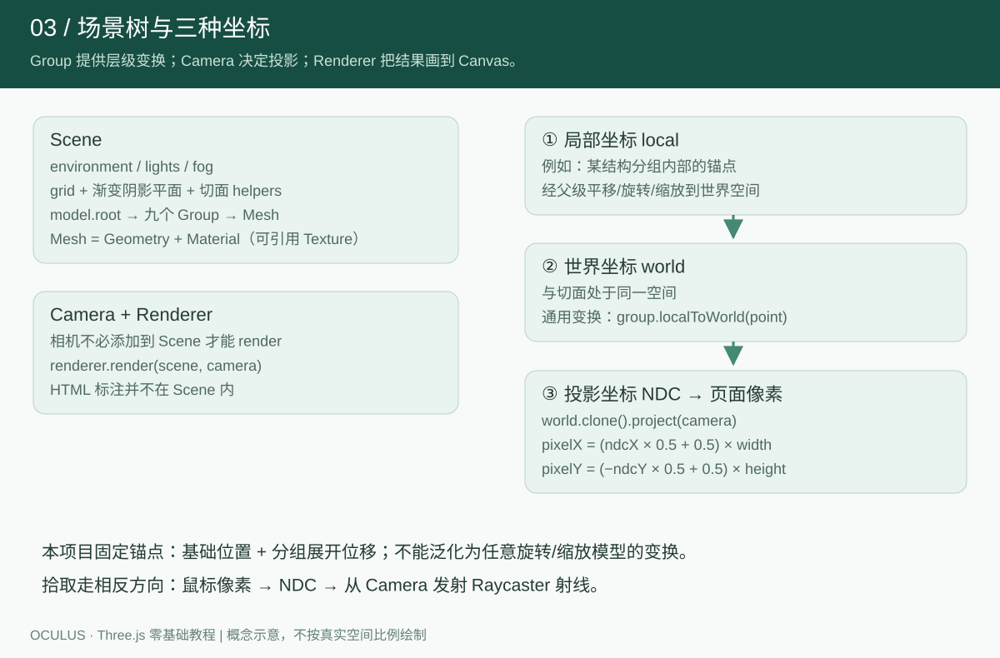

*图 6：模型树是三维对象之间的关系，HTML 页面树是另一套关系。将它们连接起来的是投影和事件，不是简单嵌套标签。*

### 7.1 Scene 与 Renderer

| 源码设置 | 作用 | 初学者容易误解的地方 |
| --- | --- | --- |
| `new THREE.Scene()` | 承载可渲染对象 | 创建后默认没有眼球 |
| `scene.background` | Canvas 背景颜色 | 不等于环境照明 |
| `new THREE.Fog(color, 11, 22)` | 远处对象逐渐融入背景 | 不会修改模型几何 |
| `antialias: true` | 请求抗锯齿缓冲 | 不保证所有边缘绝对平滑 |
| `preserveDrawingBuffer: true` | 保留缓冲，服务 PNG 导出 | 是输出取舍，不是通用性能优化 |
| `setPixelRatio(Math.min(devicePixelRatio, 2))` | 高分屏更清晰，同时限制像素开销 | DPR 越大，绘制像素数增长很快 |
| `localClippingEnabled = true` | 开启材质局部剖切功能 | 只创建 Plane 不够 |
| `ACESFilmicToneMapping` / `0.93` | 映射高动态颜色并调节曝光 | 与灯光和材质一起影响画面亮度 |

Renderer 的 Canvas 被 `container.prepend()` 放进 `#scene`。其它工具和标注叠在 Canvas 上方；它们没有成为 Three.js 模型的一部分。

### 7.2 透视相机的四个参数

```js
this.camera = new THREE.PerspectiveCamera(36, 1, 0.05, 100);
```

这是**源码摘录**：垂直视野角 36°、初始宽高比 1、近裁剪距离 0.05、远裁剪距离 100。只有在视锥范围内的对象才能正常进入画面。宽高比稍后由 `resize()` 更新。

近/远裁剪面与用户的 X/Y/Z 剖切不是同一回事：前者是相机可见范围，后者是材质决定丢弃哪些片元。

### 7.3 材质为什么会有立体感

几何只定义表面位置，**法线**提供表面的朝向。光照结合材质参数计算亮暗，才让一个球看起来有体积。

- `color`：基础颜色，和颜色贴图、光照共同影响结果，不是屏幕最终颜色的保证值。
- `roughness`：粗糙程度，影响反射扩散。
- `metalness`：金属表现参数，不代表模型真的采用金属材质。
- `clearcoat`：表层清漆效果；不是完整的生物组织光学仿真。
- `side: DoubleSide`：表面正反面都画；**不会把薄片变成实体**。
- `map`：基础颜色纹理。UV 决定几何点去图片的哪个位置取颜色。
- `transparent`、`opacity`、`depthWrite`：透明表现与深度写入，详见第 11 节。

### 7.4 环境贴图与灯光各做什么

构造函数通过 `RoomEnvironment` 创建环境，再用 `PMREMGenerator.fromScene()` 预处理成适合不同粗糙度采样的环境纹理，设置给 `scene.environment`。

可以把它理解成“材质周围可供反射的房间”，不是贴在眼球上的虹膜图片。临时房间和生成器使用后释放，但生成结果 `this.environment` 要保留，否则场景仍在使用它时资源就失效了。

此外还有：

- `HemisphereLight`：用天空色与地面色补充整体明暗。
- 主 `DirectionalLight`：从上前侧照射，强化体积感。
- 补 `DirectionalLight`：从另一侧补充偏冷光。

需要调整外观时，应一起考虑材质、环境、光强、曝光，而不是只把某个 `color` 改得越来越亮。

### 7.5 网格、阴影与辅助平面

`GridHelper` 给出空间参考；地面下方的“阴影”是将 Canvas 径向渐变贴到透明 Plane 上，再把 Plane 转为水平。

它不是动态阴影贴图，模型移动后不会自动重新计算真实投影。`PlaneHelper` 则显示剖切平面的位置，也不负责做几何切割或封口。这里没有因为 `clipShadows = true` 就自动开启一套实时阴影系统。

### 7.6 一个 Mesh 最后怎样变成像素

调用 `render()` 后，Three.js 帮你组织 WebGL 工作。可以先用下面的简化流程理解，不需要马上编写着色器：

1. **准备数据**：Geometry 保存顶点位置、法线、UV 和可选的三角形索引；Material 描述表面规则；Texture 保存图片数据。需要时将这些数据上传到 GPU。
2. **变换顶点**：将局部位置沿父级变换到世界空间，再变成相机观察空间，经过透视投影确定它在画面中的位置。
3. **把三角形覆盖到像素区域**：这个过程叫光栅化，产生许多片元。片元可以先理解成“某个表面在某个像素位置上准备贡献的颜色和深度”，不是已经确定的最终像素。
4. **计算表面颜色**：着色器结合材质、光照、法线和纹理计算颜色；本项目的剖切会让不满足条件的片元被丢弃。
5. **处理前后关系与透明混合**：深度测试和混合决定哪些贡献最终留下，配合输出颜色处理形成 Canvas 上的画面。

所以“改材质”“改几何”“移动相机”影响的是不同环节。`opacity=0.5` 不会删除一半顶点；裁剪片元不会自动制造新三角形；移动相机也不会改写 GLB 文件。这里是帮助建立认识的简化管线，不要求初学者直接操作底层 WebGL。

<a id="camera"></a>
## 8. 相机交互、坐标与自适应尺寸

### 8.1 OrbitControls：移动镜头，不是旋转眼球根节点

`new OrbitControls(camera, renderer.domElement)` 将指针事件绑定到 Canvas：左键旋转、滚轮改变距离、右键平移；触摸使用单指旋转、双指缩放/平移。

本项目的限制与目的：

| 设置 | 当前值/行为 | 目的 |
| --- | --- | --- |
| `enableDamping` / `dampingFactor` | `true` / `0.08` | 松手后平滑收敛，因此循环必须 update |
| `minDistance` / `maxDistance` | `3.4` / `14` | 防止太近穿入模型或太远看不清 |
| `maxPolarAngle` | `Math.PI * 0.92` | 限制绕到极端底部的角度 |
| `autoRotateSpeed` | `0.8` | 自动绕目标观察的速度 |
| `controls.target` | 观察中心 | 与相机位置共同决定方向，不是模型的 position |

`resetCamera(direction)` 支持透视、正面和右侧预设，小屏使用更远的默认位置。它重置相机和 target，**不重置剖切、可见性或自动旋转开关**。

### 8.2 `zoom(factor)` 为什么沿观察方向移动

**源码摘录：**

```js
const offset = this.camera.position.clone().sub(this.controls.target);
offset.setLength(THREE.MathUtils.clamp(offset.length() * factor, this.controls.minDistance, this.controls.maxDistance));
this.camera.position.copy(this.controls.target).add(offset);
this.controls.update();
```

`camera.position − target` 是“从目标指向相机”的向量。改变它的长度再加回 target，就能沿当前方向拉近或拉远，不会跳到世界原点。这里改的是观察距离，不是修改 `camera.zoom` 或相机焦距。

UI 的百分比也是按参考观察距离计算的相对数值，不能作为眼球尺寸、放大倍率或医学测量标定。

### 8.3 键盘与尺寸变化

Canvas 通过 `tabindex="0"` 可以聚焦。方向键把相机相对 target 的向量转为 `Spherical`，修改方位角/极角，再转回三维向量。`makeSafe()` 避免恰好落在球坐标两极的退化情况；`+`、`-` 复用缩放逻辑。

`resize()` 读取**容器**宽高，更新 `camera.aspect`，调用 `updateProjectionMatrix()`，再 `renderer.setSize()`。监听容器而不只是窗口，是为了覆盖侧栏调整和全屏造成的实际画布大小变化。CSS 显示尺寸和 Canvas 内部像素缓冲尺寸是两回事。

<a id="loop"></a>
## 9. 渲染循环与性能数字

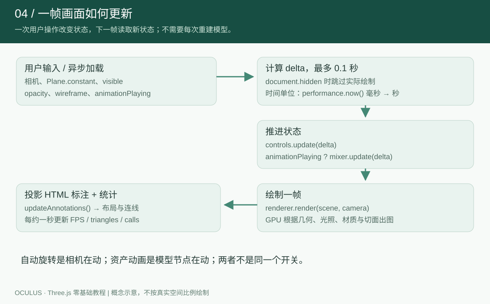

*图 7：页面事件负责修改状态，循环负责消费状态。修改滑块不必重新请求 GLB。*

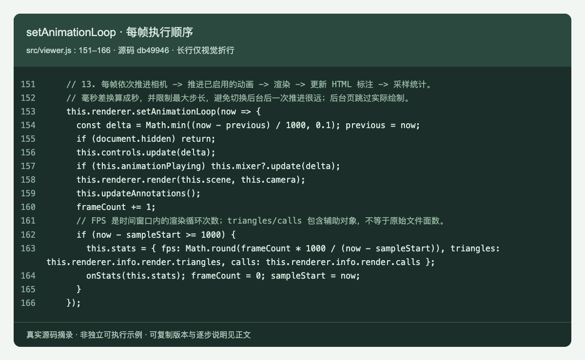

*图 8：源码中的循环顺序。`onStats` 约每秒调用一次，不是每帧重建全部页面。*

核心**源码摘录**：

```js
this.renderer.setAnimationLoop(now => {
  const delta = Math.min((now - previous) / 1000, 0.1); previous = now;
  if (document.hidden) return;
  this.controls.update(delta);
  if (this.animationPlaying) this.mixer?.update(delta);
  this.renderer.render(this.scene, this.camera);
  this.updateAnnotations();
  frameCount += 1;
  if (now - sampleStart >= 1000) {
    this.stats = { fps: Math.round(frameCount * 1000 / (now - sampleStart)), triangles: this.renderer.info.render.triangles, calls: this.renderer.info.render.calls };
    onStats(this.stats); frameCount = 0; sampleStart = now;
  }
});
```

为什么这样写：

- 动画需要“经过多少秒”，不能固定每帧移动相同距离，否则高帧率机器动得更快。
- 帧时间差限制为 0.1 秒，减少从后台返回后突然推进很远的情况。
- `document.hidden` 时跳过实际绘制；本项目不是静止时完全停止循环的按需渲染器。
- 先更新相机与动画，再画图，否则画面可能落后一帧。
- 画完后用当前相机投影 HTML 标注，让标签跟随视角。

统计数字怎么读：

| 数字 | 真正含义 | 不能据此推断 |
| --- | --- | --- |
| FPS | 采样窗口内执行绘制循环的频率 | 所有设备都能达到相同帧率 |
| triangles | Renderer 本帧统计的三角形提交数量 | GLB 原始面数，或剖切后剩余的几何体积 |
| calls | 渲染调用数量 | 只由文件大小决定的性能 |
| importMs | 本地解析、准备模型的耗时 | 网络下载到首屏的总时长 |

辅助网格、阴影等也参与渲染。线框模式可能使 triangle 统计明显变化；材质剖切丢弃片元，不代表 CPU 把三角形数量删掉。截图里的 FPS 是当时采样，不是本教程给出的性能承诺。

<a id="clipping"></a>
## 10. 重点：三轴剖切与交并集

### 10.1 先区分“看起来切开”与“真的切开几何”

当前使用**材质剖切**：GPU 根据平面判断某个片元是否继续绘制。原 Geometry 没有被切成两个新 Geometry，也没有生成填满缺口的封盖。

因此原模型仍可被射线求交，需要额外过滤；导出模型也不能只靠保存这些显示状态获得实体切割结果。

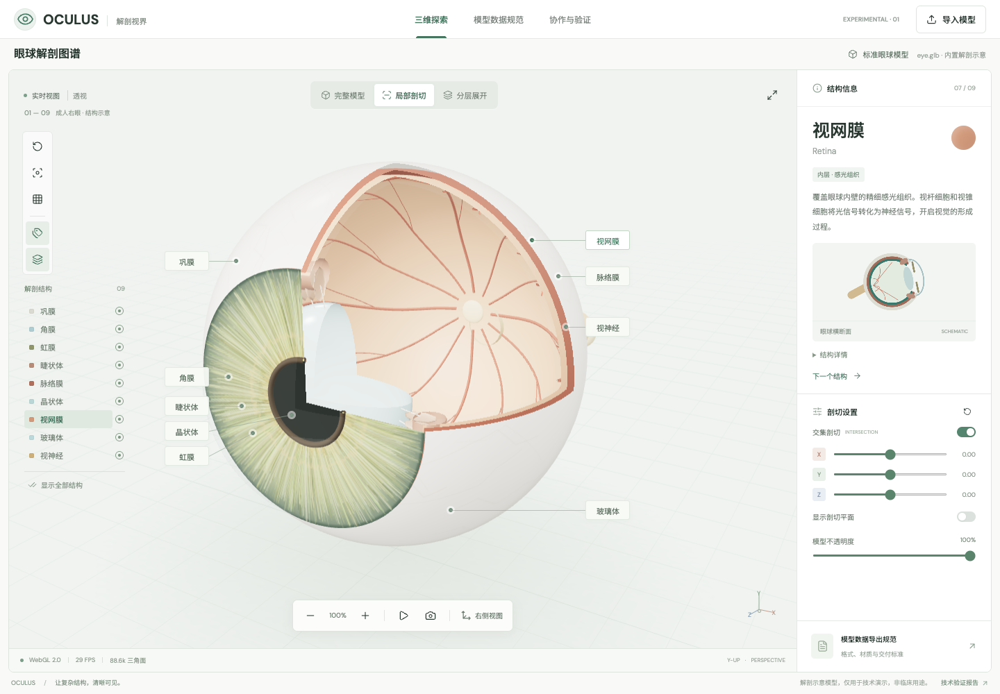

*图 9：刷新后的默认状态，三轴均启用、constant 为 0、交集开关开启。右上前方向被裁去一部分，露出内部表面。*

### 10.2 平面方程只需要掌握一个式子

```text
distance = normal.dot(point) + constant
distance < 0：位于该平面的裁剪侧
distance = 0：位于边界
```

本项目三条法线分别为 `(-1, 0, 0)`、`(0, -1, 0)`、`(0, 0, -1)`。以 X 为例：

```text
normal = (-1, 0, 0)
distance = -x + constant
constant = 0    → x > 0 的点在负侧
constant = 0.75 → x > 0.75 的点在负侧
```

所以增加 X 滑块的值，不是“旋转平面”，而是改变它的位置。负侧由法线方向决定，不能简单认为“负坐标一定被裁掉”。这些裁剪平面使用**世界空间**；模型移动时，材质不会自动把世界平面变成每个网格自己的局部平面。

### 10.3 多个平面的交集与并集

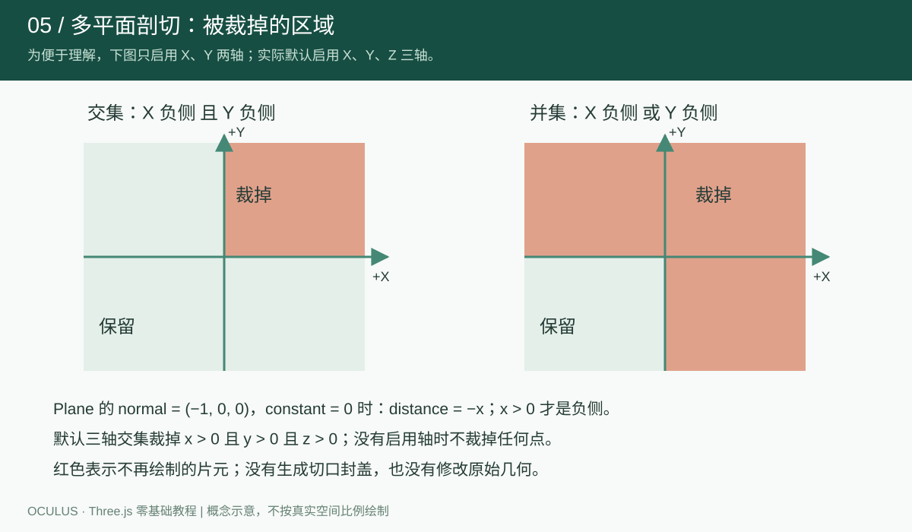

*图 10：红色表示被裁掉的区域。图中关闭 Z 轴方便观察二维关系；实际默认三轴开启。*

| 条件（默认法线，constant=0） | 交集 `true` | 并集 `false` |
| --- | --- | --- |
| 点 `(1, 1, 1)` | 裁掉 | 裁掉 |
| 点 `(1, -1, 1)` | 保留，因为没有同时满足全部平面 | 裁掉，因为至少满足一个平面 |
| 点 `(-1, -1, -1)` | 保留 | 保留 |
| 全部轴关闭 | 不裁剪 | 不裁剪 |

这里说的是**被裁区域**的交集或并集，不要和“保留区域”的集合含义说反。

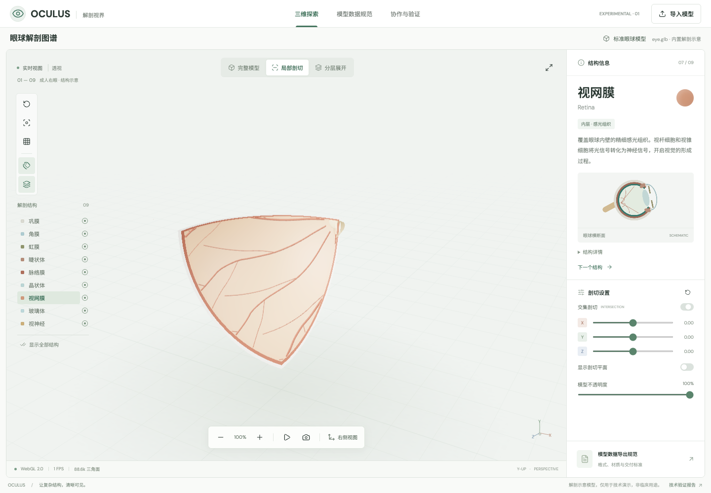

*图 11：保持默认三轴与数值，关闭“交集剖切”。被裁区域扩大，保留部分明显缩小。*

### 10.4 `applyClipping()`：把状态同步给材质

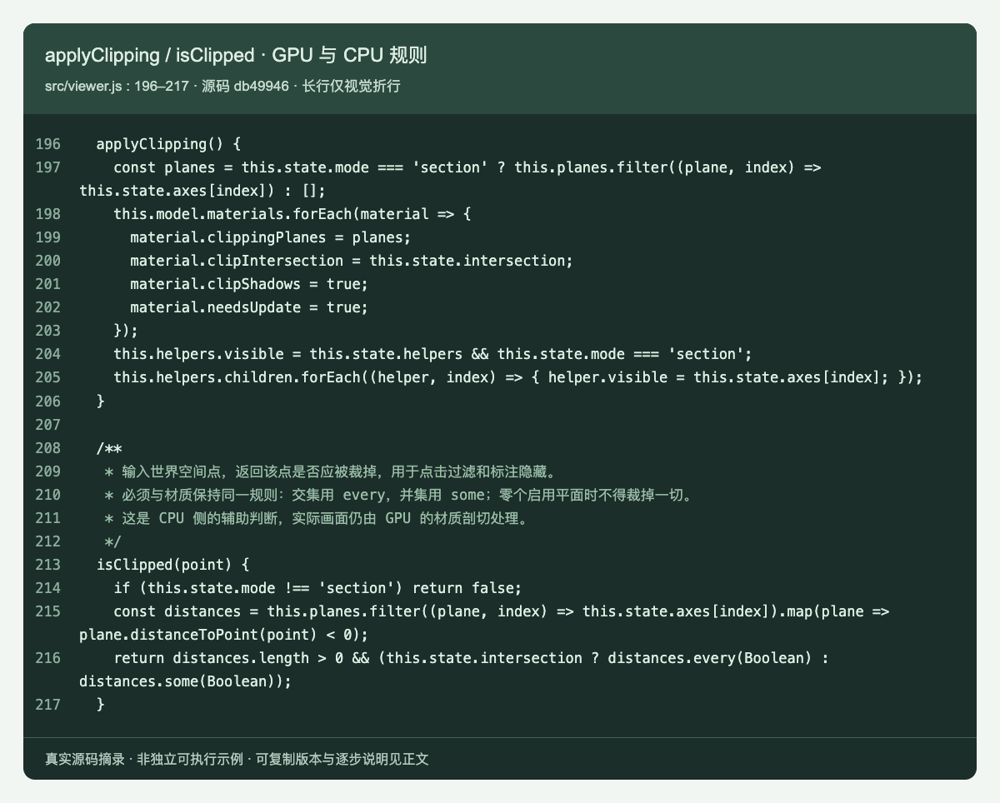

*图 12：GPU 画面的剖切配置与 CPU 拾取/标注判断使用相同的模式和启用轴。*

关键**源码摘录**：

```js
const planes = this.state.mode === 'section' ? this.planes.filter((plane, index) => this.state.axes[index]) : [];
this.model.materials.forEach(material => {
  material.clippingPlanes = planes;
  material.clipIntersection = this.state.intersection;
  material.clipShadows = true;
  material.needsUpdate = true;
});
```

1. 只有 `section` 模式提供裁剪平面；完整和展开模式使用空数组。
2. `state.axes` 是三个布尔值，控制哪些平面参与，不是创建三个不同模型。
3. 将同一组 Plane 对象引用交给所有材质，保证各组织一起切。
4. `needsUpdate` 通知渲染器材质程序配置发生变化，不会重新加载 GLB。
5. 方法还同步 helpers 的总显隐与各轴显隐。

### 10.5 为什么滑块不调用 `applyClipping()`

`main.js` 在滑块 `input` 事件中只执行：

```js
viewer.planes[Number(input.dataset.plane)].constant = Number(input.value);
```

这是**源码摘录**。材质已经引用了这些 Plane，下一帧可读取新的 constant。轴开关和交并集改变的是平面集合/配置，所以要重新 `applyClipping()`。

### 10.6 `isClipped(point)`：CPU 也必须懂剖切

```js
if (this.state.mode !== 'section') return false;
const distances = this.planes.filter((plane, index) => this.state.axes[index]).map(plane => plane.distanceToPoint(point) < 0);
return distances.length > 0 && (this.state.intersection ? distances.every(Boolean) : distances.some(Boolean));
```

这是方法内部的**源码摘录**，输入世界坐标点，输出“这个点是否应隐藏”。交集使用 `every`，并集使用 `some`。`distances.length > 0` 很重要，因为空数组的 `every()` 是 true；缺少这个条件会错误地把“全轴关闭”解释为“全部被裁掉”。

该函数供射线点击与标注使用，不负责实际画面渲染。画面交给 GPU，交互判断交给 CPU，两边规则必须一致。


*图 13：开启“显示剖切平面”后可观察 X/Y/Z 边界。它们只是辅助对象，不是新增切面实体。*

“重置剖切”将滑块归零、启用全部轴、恢复交集并关闭 helpers；通过派发已有 input/change 事件复用更新链，避免控件显示归零而 Three.js 状态没变。

<a id="display"></a>
## 11. 展示模式、透明度与线框

### 11.1 `setMode(mode)`：三种模式如何复用模型

| 模式 | 分组位置 | 材质剖切 | 限制 |
| --- | --- | --- | --- |
| `whole` | 恢复基准位置 | 无 | 不会自动恢复已隐藏图层 |
| `section` | 恢复基准位置 | 按当前启用轴应用 | 不生成封口 |
| `exploded` | 基准位置 + 手工偏移 | 无 | 仅内置九组有偏移定义 |

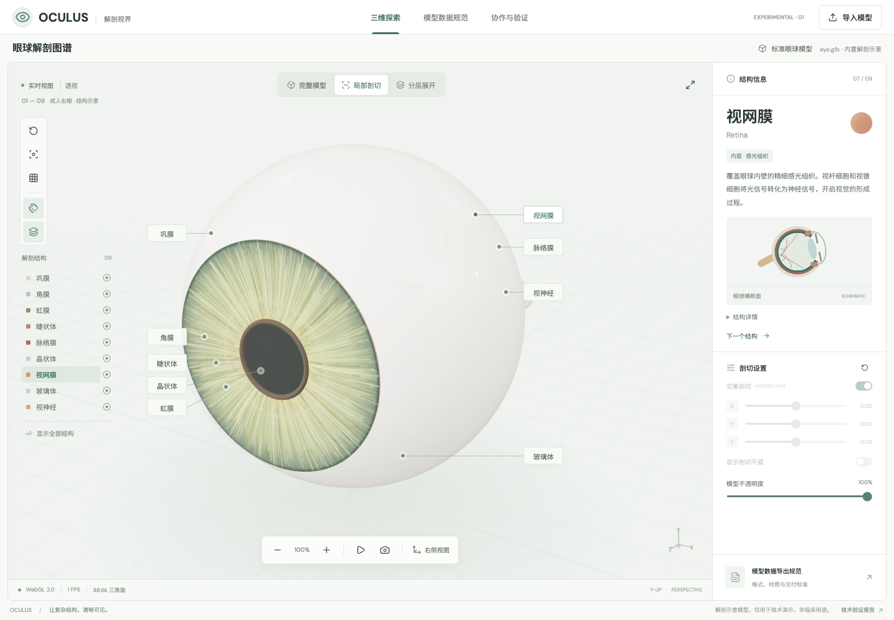

*图 14：点击“完整模型”。这是同一个 GLB，不是换成另一个模型文件。*

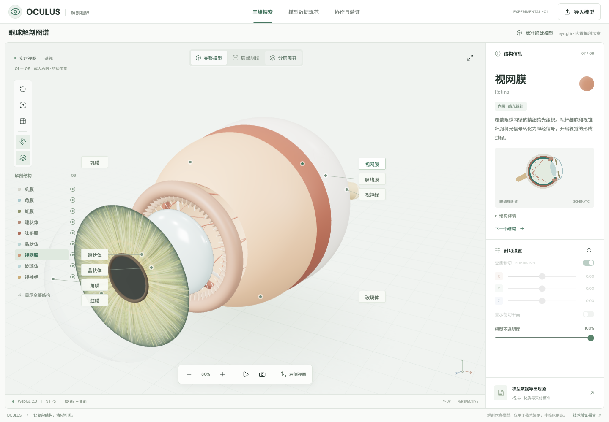

*图 15：点击“分层展开”。角膜、虹膜、晶状体等分开，Viewer 同时重置并拉远相机。*

构造时 `basePositions` 保存 `group.position.clone()`。每次切换模式先恢复基准，再加 `directions[id]`。如果直接反复 `position.add()` 而不恢复，多点几次展开就会越跑越远。

展开并不是沿法线自动爆炸，也不是对模型做结构识别。外部模型没有对应位移定义，所以页面禁用其展开按钮。调用页面级 `setMode()` 还会同步模式按钮和剖切控件可用性；仅在控制台调用 Viewer 方法不会自动同步所有 UI。

### 11.2 `setOpacity(value)`：保留原始表面性质

输入是 `0～1` 的倍率；页面将百分数除以 100。第一次修改时，将每个材质的 `opacity`、`transparent`、`depthWrite` 保存到 `material.userData.originalSurface`。

```js
material.opacity = original.opacity * value;
material.transparent = value < 1 || original.transparent;
material.depthWrite = value < 1 ? false : original.depthWrite;
material.needsUpdate = true;
```

这是**源码摘录**。比如角膜原透明度是 0.1，整体 50% 后是 0.05；恢复 100% 后仍是 0.1，而不是变成不透明墙。

`depthWrite` 表示是否把当前表面深度写入缓冲。淡化时关闭它可以减少半透明表面挡住后绘制内容的问题，但不等于关闭 `depthTest`，也不能解决所有透明排序与折射问题。

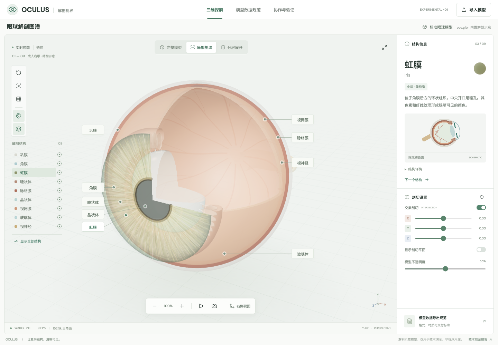

*图 16：选中虹膜后将模型不透明度调至 55%。恢复 100% 会恢复原始表面配置，而非强制所有组织完全不透明。*

### 11.3 线框与显隐不是一回事

线框按钮遍历 `model.materials`，设置 `material.wireframe`。它让你看到三角形边线，适合理解曲面细分，不删除几何，也不等于导出了“线模型”。

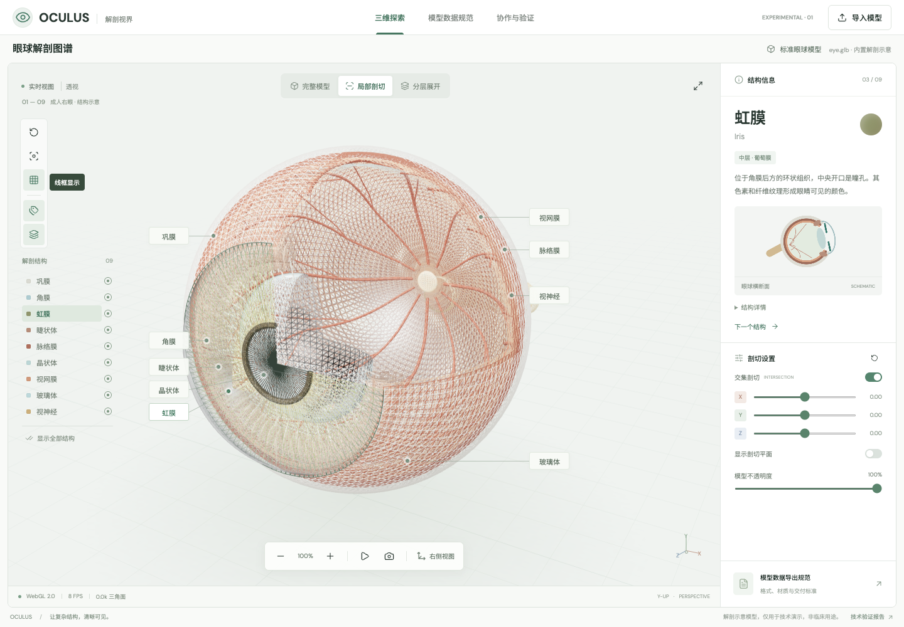

*图 17：恢复整体不透明度至 100% 后打开线框。屏幕较密的区域反映网格细分，统计栏的 triangle 数不能按普通表面模式解释。*

图层显隐修改 `groups.get(id).visible`。`visible=false` 只是暂时不画，不会释放 GPU 资源；“显示全部结构”触发已有复选框 change 事件恢复显隐，不重置当前选择。

<a id="selection"></a>
## 12. 重点：拾取、高亮与图文联动

### 12.1 所有入口必须回到 `selectPart(id)`

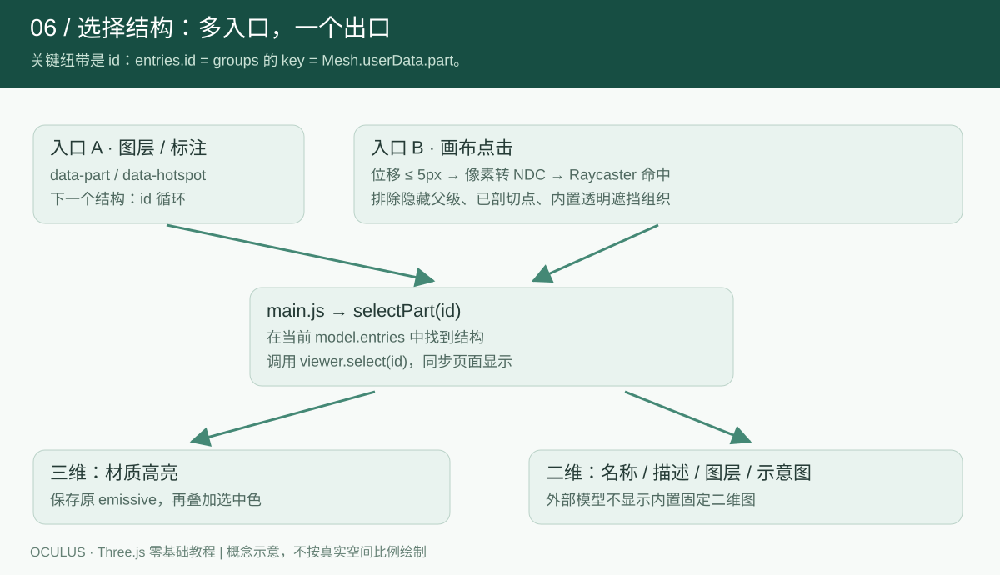

*图 18：入口有多个，但图文更新只有一条主链，避免点击标签和点击模型出现两套不一致的行为。*

`main.js` 的 `selectPart()`：在当前 `model.entries` 找到 id → 调用 `viewer.select(id)` → 更新文字与颜色 → 更新图层/热点选中状态 → 内置模型重画二维示意图。

要查当前模型的 entries，不能永远查静态 `anatomy`，因为外部模型的 id 是 `import-1` 等。导入名称与页面文本用 `textContent` 写入，不当成 HTML 执行。

### 12.2 鼠标怎么知道点到哪个 Mesh

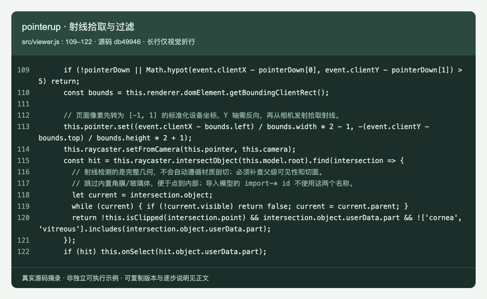

*图 19：`EyeViewer` 的 pointerup 处理。完整几何的射线命中不等于最终可见表面的有效点击。*

首先在 pointerdown 记录位置。pointerup 与其距离大于 5px，视为拖动，不进行选择，避免转动相机时频繁误选。

接着把鼠标位置换成 NDC。**源码摘录：**

```js
const bounds = this.renderer.domElement.getBoundingClientRect();
this.pointer.set((event.clientX - bounds.left) / bounds.width * 2 - 1, -(event.clientY - bounds.top) / bounds.height * 2 + 1);
this.raycaster.setFromCamera(this.pointer, this.camera);
```

举例：点击画布中心，X/Y 都为 0；左边缘 X 为 -1，右边缘 X 为 1。浏览器 Y 向下增加，NDC Y 向上增加，所以公式有负号。必须减去 Canvas 的 left/top，不能直接用整个窗口宽高算。

`intersectObject(model.root)` 在当前 r186 默认递归检测后代，返回按距离排序的命中列表。项目用 `.find()` 找到第一个符合条件的命中：

1. 从命中对象向父级走，任何父级隐藏都排除。
2. `isClipped(intersection.point)` 为 true 时排除。
3. 必须有 `userData.part` 才能回到结构 id。
4. 内置 `cornea`、`vitreous` 不作为点击目标，方便点到被透明组织罩住的内部。

最后调用 `onSelect(hit.object.userData.part)`。这是“Viewer 通知页面”，不是 Viewer 自己重建侧栏。外部模型 id 不叫 `cornea`、`vitreous`，不会自动套用这两个点击排除规则。

### 12.3 `select(id)`：怎样高亮而不破坏原色

Viewer 遍历各组材质。只有带 `emissive` 的材质参与，首次保存 `originalEmissive`；每次先恢复原值，再给选中组叠加微弱颜色。

自发光高亮不是加一个聚光灯，也没有修改 Geometry。这样取消选择时不会把原本就有自发光的导入模型全部重置成黑色。外部导入会按 Mesh 克隆材质，否则多个 Mesh 共享材质时，高亮一个会连带影响其它网格。

### 12.4 图层、文字与二维图如何同步

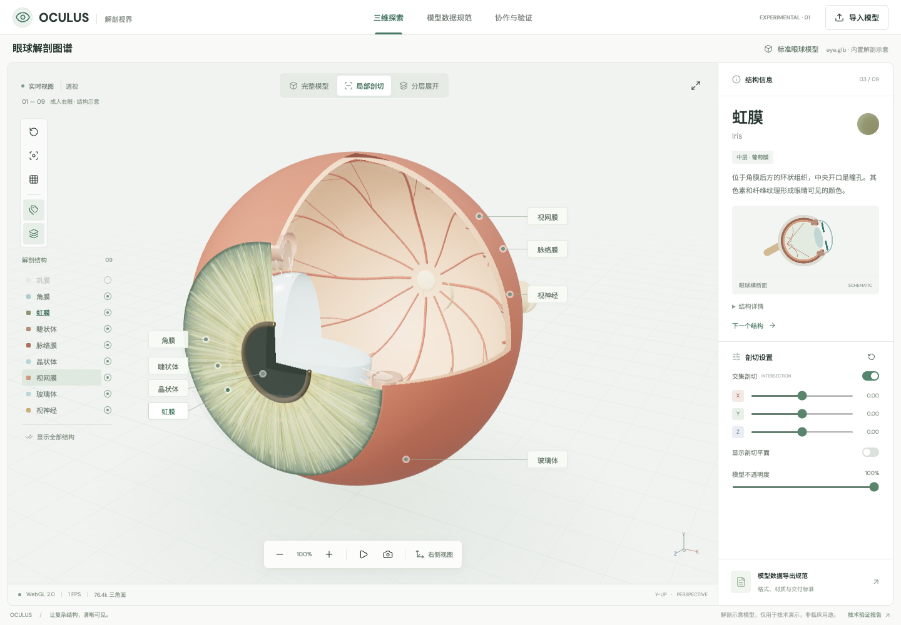

*图 20：点击图层“虹膜”，再取消“显示巩膜”。选中与隐藏是两个独立动作；左侧可见性、当前名称和二维强调随各自规则更新。*

`content.js` 的 `anatomy` 提供九条数据：`name`、`english`、`category`、`description`、`function`、`relation` 用于文字，`color` 用于 UI 色块，`number` 用于显示顺序。`feature` 当前保留在数据里但未展示。UI 的 color 不是三维材质颜色的唯一来源。

`drawDiagram(canvas, selected='retina')` 无返回值：设置 640×380 绘图缓冲 → 背景 → `save()` → 平移旋转 → 视神经、组织弧线、内部形状和血管 → `restore()`。绘制顺序决定谁覆盖谁。选中 id 决定强调色，不读取 GLB 或相机，不是三维剖切结果的截图。

<a id="annotations"></a>
## 13. 重点：三维标注如何贴在页面上

### 13.1 为什么标签看起来跟着眼球走

`eye.js` 的 `eyeAnnotations` 提供九个 `{ id, position, side }`：position 是手工定义锚点，side 表示标签排在左列还是右列，并非医学左右。

`main.js` 使用它生成按钮；Viewer 缓存对应 DOM。每帧 `updateAnnotations()` 取锚点、加上内置分组展开位移，然后投影到页面。

**源码摘录：**

```js
const world = new THREE.Vector3(...annotation.position).add(group?.position || new THREE.Vector3());
const position = world.clone().project(this.camera);
```

图 6 已展示完整坐标链。本项目采用位置相加，是因为固定眼球分组只使用已知展开位移；这不是任意层级模型的通用公式。若分组有旋转、缩放或复杂父级变换，应先用真实局部到世界变换，例如 `group.localToWorld(point)`，再投影。当前导入模型不使用这套固定锚点，所以不会错误标注。

### 13.2 标签什么时候隐藏

每个标签同时要求：标签总开关开启、内置模型、组 visible、世界锚点没有被剖切、投影点在视锥范围内。

因此隐藏巩膜只会影响相应标签；切面掠过锚点会隐藏标签；转动到锚点离开视野也会隐藏。**没有做其它 Mesh 对锚点的遮挡射线检测**，所以完整模型下仍可能通过标签选择内部结构。这是已实现规则，不应描述为“所有标签都会被前方表面正确遮挡”。

### 13.3 投影点和最终标签位置不是同一个位置

投影点用来决定连线锚点，标签还需要避让：

1. 按 `side` 分左右列，按投影 Y 从上到下排序。
2. 读取左侧工具栏、图层面板边界，为它们留空间。
3. 根据最外侧锚点计算列 X，用 `clamp()` 限制在可用范围。
4. 依次推开标签，使用标签高度加 8px 作为间距，同时为后续标签预留空间。
5. 写入 `left/top` 与连线长度、角度等 CSS 变量，连接真实锚点和排版后的标签。

这是一套适用于九个固定标签的简单布局，不是面向任意数量和任意字体的通用碰撞求解器。增加大量标签前，应重新验证空间上限。

右下角 XYZ 方向标也在此函数更新：相机 quaternion 的逆旋转把世界轴转成观察者方向，再写入页面线段长度与角度。它是 HTML 方向示意，不是另一个独立的 Three.js 小场景。

<a id="import"></a>
## 14. 重点：导入 GLB、glTF、OBJ

### 14.1 先认识格式，而不是只认识扩展名

| 格式 | 本项目怎样读取 | 需要注意 |
| --- | --- | --- |
| GLB | 二进制 ArrayBuffer → GLTFLoader | 通常可打包几何、贴图与动画；本项目未配置压缩解码器 |
| glTF | JSON 文本 → GLTFLoader | 可以引用外部 `.bin` 和图片，必须一起选择 |
| OBJ | 文本 → OBJLoader | 主要是静态几何；材质由 MTL 提供，纹理另选 |
| MTL | 文本 → MTLLoader | 不是独立模型主文件；当前支持一个引用材质库 |

文件扩展名只用于选解析入口，不保证内容正确。改名不能把 FBX 变成 GLB。文件选择器的 `accept` 只提供选择提示，真正检查在 `validateFiles()` 和 Loader 中。

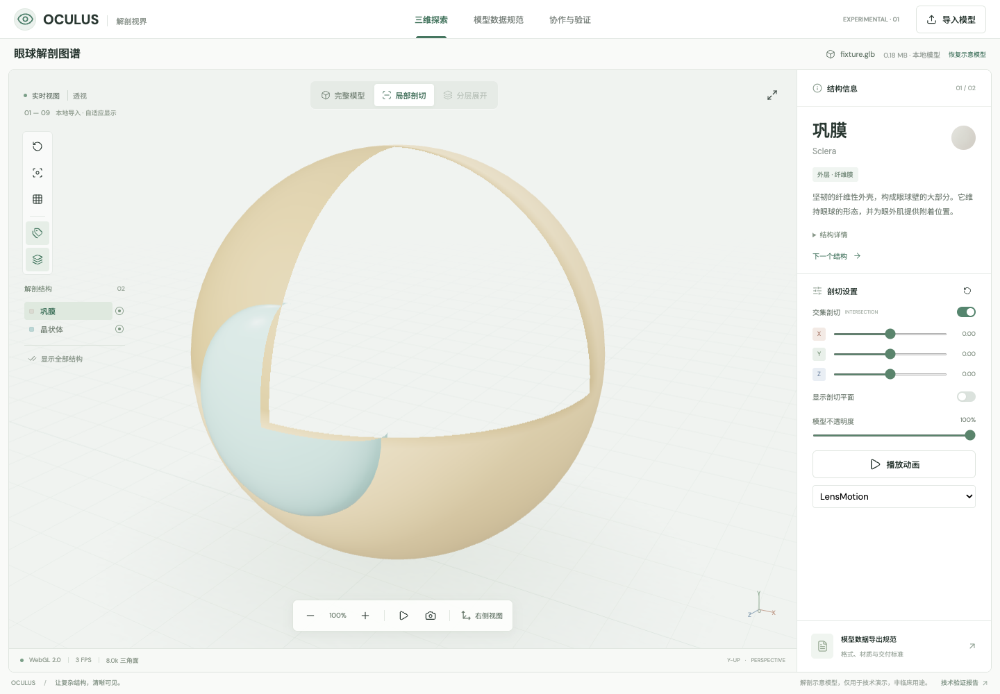

*图 21：先运行浏览器测试生成 `test-results/fixture.glb`，再通过文件选择器导入。它是用来验证贴图与动画的合成模型，不是另一份专业眼球资产。*

### 14.2 `validateFiles(files)`：入口校验

**位置：**`src/import-model.js`。输入文件数组，返回唯一主文件，错误时抛出带可读说明的 Error。

检查空列表、文件总大小、唯一主文件和重名资源：

- 总大小上限按 `100 * 1024 * 1024` 字节计算；恰好等于上限可通过。
- 必须恰好一个 `.glb` / `.gltf` / `.obj` 主文件，扩展名匹配忽略大小写。
- 附件以文件名匹配，拒绝重名；当前重名判定按名称原值比较，不是完整目录树解析。
- 100 MB 是输入上限，不是性能承诺。高面数和高分辨率贴图仍可能卡顿或超出设备显存。

### 14.3 `loadModel(fileList)`：本地资源如何交给 Loader

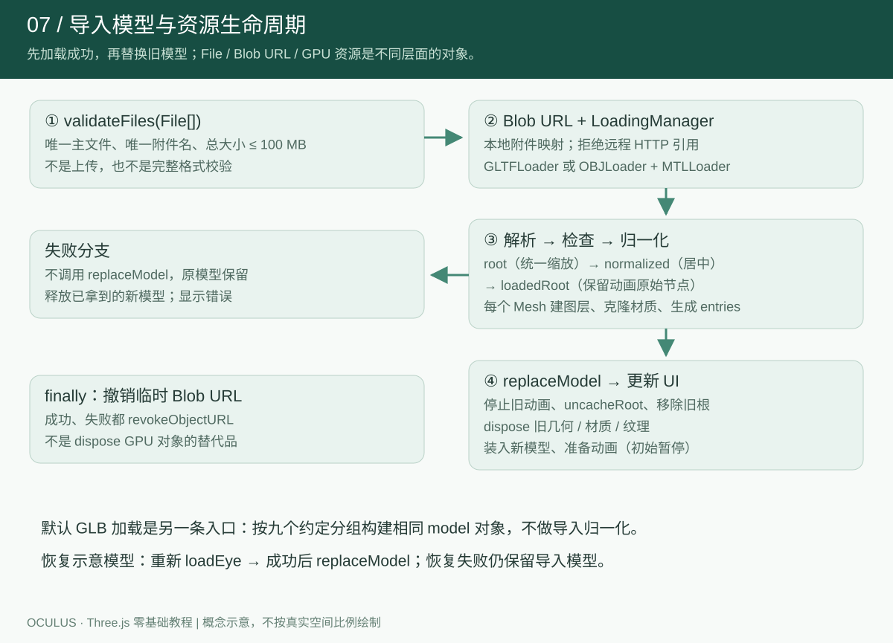

*图 22：格式适配层只返回 model；页面拿到成功结果后才替换 Viewer 中的旧模型。*

1. `Array.from(fileList)` 后校验，记录起始时间。
2. 每个 File 建立一个 `URL.createObjectURL(file)`，放入 Map。这是浏览器临时引用，不上传服务器。
3. `LoadingManager.setURLModifier()` 截获 Loader 要读取的资源地址。
4. 内嵌 data 与 blob 地址直接使用；HTTP/HTTPS 或协议相对远程资源被拒绝。
5. 普通附件路径取末尾文件名、解码后查 Map；找不到就报告缺文件。
6. 记录加载器的资源错误，防止主模型返回成功但贴图失败时把它误判为完整导入。

文件名映射是一种刻意受限的适配：选择 `textures/iris.png` 时按 `iris.png` 对应，不恢复整棵目录，也不解压 ZIP。如果不同目录存在同名图，需要先改为唯一文件名。

### 14.4 GLB 与 glTF 分支

```js
const data = extension === 'glb' ? await main.arrayBuffer() : await main.text();
const gltf = await new GLTFLoader(manager).parseAsync(data, '');
loadedRoot = gltf.scene; animations = gltf.animations;
```

这是**源码摘录**。一个 Loader 处理两种容器。第二参数为空基础路径，附件由 URLModifier 接管。当前没有 `DRACOLoader`、`KTX2Loader` 或 Meshopt decoder；对需要这些解码器的压缩资产，不能笼统说“GLB 支持，所以一定能打开”。

### 14.5 OBJ 与 MTL 分支为什么更绕

- 从 OBJ 文本提取 `mtllib`，超过一个引用材质库就拒绝。
- 有引用但未选择 MTL 时错误；没有引用时可用默认材质加载。
- `MTLLoader.parse()` 读材质，`preload()` 可能启动异步纹理任务。
- 必须在 preload 前挂好完成事件，否则可能错过。
- 只有真的启动纹理任务时才等待 texturesReady；无贴图 MTL 不能等待一个永远不发生的完成事件。
- `OBJLoader.parse()` 生成模型后，继续等已启动的纹理工作，检查解码失败，再进入统一处理。

OBJ 不提供这里所用的 glTF 资产动画。项目没有在 OBJ 导入后自动推断骨骼或运动。

### 14.6 重点：为什么用两层父组居中缩放

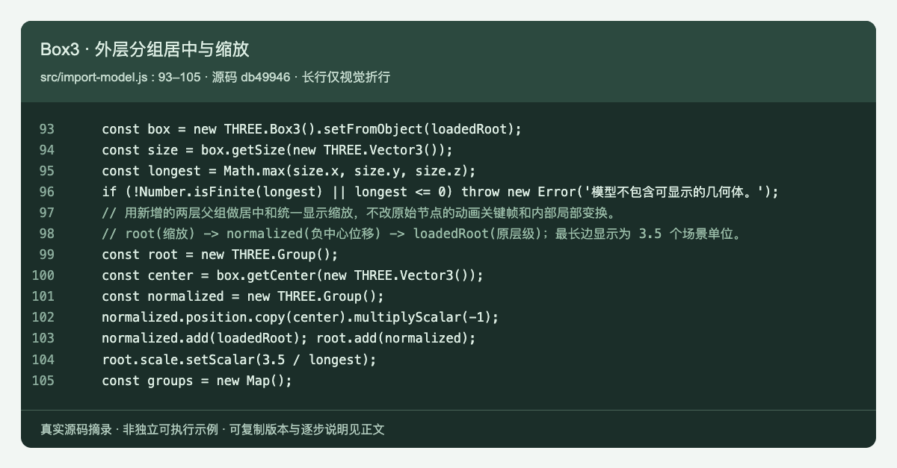

*图 23：不直接把原模型节点逐个改位置，而是在外面包上展示变换，保护原有动画层级。*

**源码摘录：**

```js
const box = new THREE.Box3().setFromObject(loadedRoot);
const size = box.getSize(new THREE.Vector3());
const longest = Math.max(size.x, size.y, size.z);
if (!Number.isFinite(longest) || longest <= 0) throw new Error('模型不包含可显示的几何体。');
const root = new THREE.Group();
const center = box.getCenter(new THREE.Vector3());
const normalized = new THREE.Group();
normalized.position.copy(center).multiplyScalar(-1);
normalized.add(loadedRoot); root.add(normalized);
root.scale.setScalar(3.5 / longest);
```

`Box3` 给出轴对齐包围盒。比如最长边为 70，则缩放倍率为 `3.5/70=0.05`。减去包围盒中心，把模型移到展示中心。

```text
root：统一缩放
└── normalized：负中心位移
    └── loadedRoot：原始节点、局部变换与动画轨道
```

先居中再由外层缩放，避免动画一播放就把你写到原节点上的“居中位置”覆盖掉。`animationRoot` 保留为 loadedRoot，让轨道继续找到原目标。这只是初始模型包围盒，不是动画全过程的最大范围；动画仍可能走出当前画面。

### 14.7 逐 Mesh 建立控制接口

遍历 loadedRoot 的 Mesh，分配 `import-1`、`import-2` 等 id；填充 groups、entries 和 `userData.part`。名称里若包含已有组织关键词，借用已有介绍；否则提示未识别。

这是命名匹配，不是计算机视觉或医学自动识别。每个 Mesh 的材质被克隆，让选择高亮独立；贴图引用仍可能共享，释放时必须去重。最后返回带动画、文件名、大小与耗时的统一 model。

### 14.8 失败为什么不清空当前模型

页面执行顺序是 `await loadModel()` 成功 → `viewer.replaceModel()` → 重建图层、选择首项、同步模式与动画 UI。解析失败时根本没有执行替换，所以原模型还在。

finally 中恢复按钮、清空文件输入值，允许修正后再次选择同名文件；加载器自己的 finally 撤销本次 Blob URL。只有“已获得的新模型根”能被 catch 遍历释放，尚未返回的加载器内部资源不应描述成已被此函数完全接管。

<a id="lifecycle"></a>
## 15. 重点：动画、替换与资源释放

### 15.1 三个动画概念各是什么

| 名称 | 作用 | 类比 |
| --- | --- | --- |
| `AnimationClip` | 一段动画的数据：持续时间、轨道、关键帧 | 乐谱 |
| `AnimationMixer` | 在指定根节点上推进动画时间与混合 | 演奏控制器 |
| `AnimationAction` | 某个 Clip 的播放状态，由 `clipAction()` 返回 | 一次具体演奏 |

`replaceModel()` 在模型带动画时创建 Mixer，激活首个 clip，但将 `animationPlaying=false`。**调用 action.play() 不等于时间已经在推进**；循环还必须 `mixer.update(delta)`。

页面播放/暂停只切换推进开关；选择其它动画时停止旧动作，`reset().play()` 新动作。相机自动旋转与模型资产动画独立，两者可分别启用。

当前内置 GLB 的动画数为 0，构造函数的首次加载路径也没有像 `replaceModel()` 那样准备 Mixer；不要把“导入模型有动画播放能力”误写为“默认眼球启动时自动播放动画”。

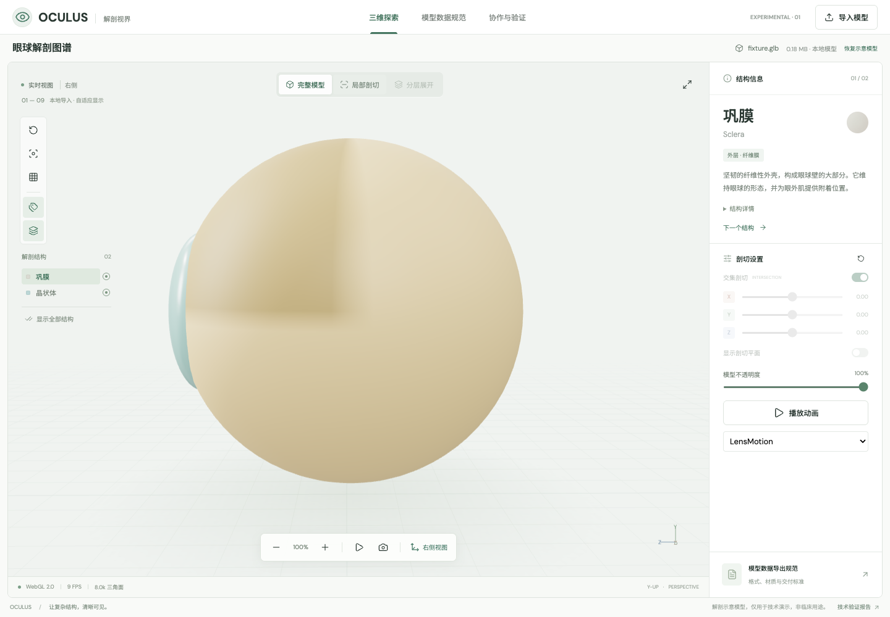

*图 24：`fixture.glb` 的 LensMotion 动画初始状态。右侧观察方便看清沿 Z 的移动。*

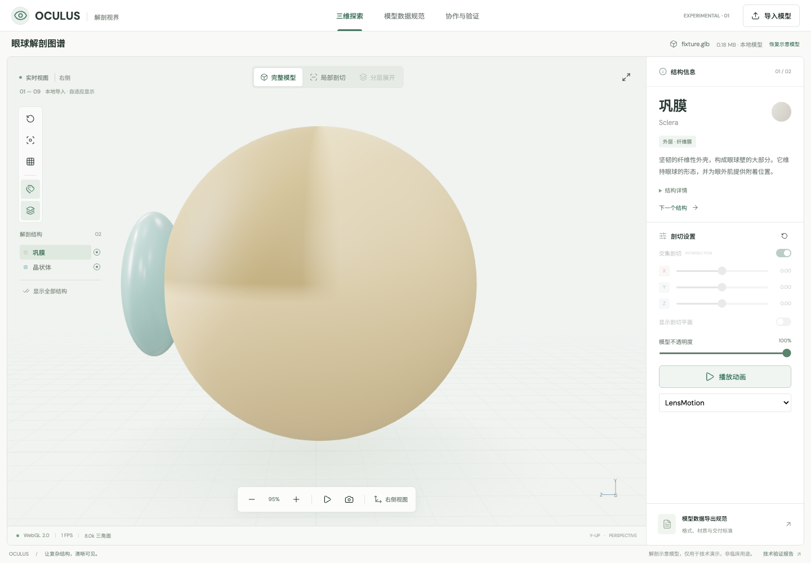

*图 25：点击“播放动画”，经过一段时间再暂停后的真实画面；不是替换模型的示意图片。测试动画在约两秒内往返，截图帧不代表动画的所有状态。*

这段测试资产的轨道名称为 `lens.position`，关键帧时间 `[0,1,2]`，Z 坐标从 1.3 到 1.6 再回 1.3。轨道必须找到对应节点；“有动画列表”本身不证明轨道成功影响了画面。

### 15.2 `replaceModel(model)` 的严格顺序

1. 旧 Mixer 停止所有动作，`uncacheRoot(old.animationRoot)` 清理绑定。
2. 从 Scene 移除旧 root，调用 `disposeModel(old)`。
3. 更新 `this.model`，将新 root 加入 Scene。
4. 保存新模型分组的基准位置。
5. 按动画列表准备 Mixer，保持初始暂停。
6. 恢复线框状态标记与整体透明度，进入 section，重置相机。
7. 页面负责重建图层与文字，而不是由 Viewer 操作所有 DOM。

替换不会清空切面常量、启用轴、交并集等所有设置；相机自动旋转、标签开关也不能一概认为都重置了。首次导入不应被理解成“一切设置恢复出厂”。

### 15.3 `disposeModel()`：从场景移除不等于释放显存

JavaScript 的垃圾回收不能替你自动决定何时释放仍关联 WebGL 的资源。这个函数遍历 root，释放 geometry；收集材质和贴图，用 Set 去重，再关闭可关闭的 ImageBitmap、dispose Texture 和 Material。

```js
textures.forEach(texture => { texture.source?.data?.close?.(); texture.dispose(); });
materials.forEach(material => material.dispose());
```

这是**源码摘录**。多个材质可能用同一张图，去重可以避免重复处理。几何目前逐对象释放，没有用同样的 Set 对共享 geometry 去重；讲解应以真实实现为准。

| 资源 | 清理动作 | 清理责任 |
| --- | --- | --- |
| 旧模型场景引用 | `scene.remove(root)` | Viewer 替换 |
| 模型几何/材质/贴图 | `disposeModel()` | 替换、已拿到模型的失败分支 |
| 旧动画绑定 | stop + uncacheRoot | Viewer 替换 |
| 本次本地文件 Blob URL | `URL.revokeObjectURL()` | 导入函数 finally |
| 临时环境生成器/房间 | 各自 dispose | Viewer 初始化 |
| Viewer 自身 renderer、环境结果、Controls、Observer、事件 | 当前没有统一 teardown 方法 | 页面生命周期范围，不由 disposeModel 接管 |

最后一行是重要边界：项目只创建一个长期 Viewer。若未来嵌入会反复挂载/卸载的页面，应补完整 Viewer 销毁流程；本教程不把尚未实现的清理描述成已完成。

### 15.4 恢复示意模型

导入成功后显示一次性的恢复按钮。点击后重新 `loadEye(eyeURL)`，成功再替换；失败只提示错误，保留已导入模型。恢复不需要刷新整个页面，也不会运行生成器。

<a id="generation"></a>
## 16. 眼球如何制作：几何、纹理与导出

这一章解释“GLB 最初从哪里来”。**不要将这条离线链路混入页面首屏加载。** `scripts/eye-source.js` 在浏览器中生成对象，`scripts/export-eye.mjs` 将其导出到资产文件。

### 16.1 `createEye()`：先建组织，再往组里装 Mesh

函数创建 `Eye_Root`，根据 anatomy 建九个 Group。每个组名等于 id，确保后续 `loadEye()` 能按约定读回来。接着生成各组织几何、材质和纹理，最后返回 `{ root, groups, materials, entries, builtin, animations }`。

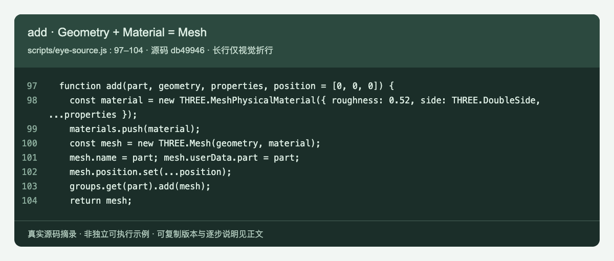

*图 26：共享装配函数负责记录材质、设置 id 和局部位置，再放进对应组织组；它不创建 Renderer。*

**源码摘录：**

```js
function add(part, geometry, properties, position = [0, 0, 0]) {
  const material = new THREE.MeshPhysicalMaterial({ roughness: 0.52, side: THREE.DoubleSide, ...properties });
  materials.push(material);
  const mesh = new THREE.Mesh(geometry, material);
  mesh.name = part; mesh.userData.part = part;
  mesh.position.set(...position);
  groups.get(part).add(mesh);
  return mesh;
}
```

`properties` 放在默认值后面，调用者可覆盖粗糙度等参数。`part` 要对应已存在分组。`return mesh` 让调用者继续修改缩放，例如把晶状体压扁。`mesh.position` 是组内局部位置，不直接等于最终屏幕位置。

### 16.2 三层球壳为什么不是三个完整球

`shell(radius)` 使用 `SphereGeometry(radius,96,64,0,2π,0.68,π−0.68)`，从球面的部分极角开始，再旋转 X 轴，让开口朝向项目约定的前方 +Z。

巩膜、脉络膜、视网膜半径依次为 1.58、1.525、1.475。半径差产生分层效果；每一层仍是表面，**不是自动构造了有厚度的封闭组织实体**。

SphereGeometry 的分段参数越高，曲面通常更细，但顶点和三角形也更多。不应为了让初学者“看到更圆”就无限增加细分。

### 16.3 纹理：复杂外观不一定需要复杂几何

`randomGenerator(seed)` 是带固定种子的伪随机数函数。相同种子产生相同序列，让纹理和血管外观稳定，便于导出前后截图比较；它不是加密随机数。

**`irisTexture()`：**

1. 创建 1024×1024 Canvas，画底色和径向渐变。
2. 2600 次循环画带随机细节的贝塞尔曲线，形成虹膜纤维。
3. 补不规则环形色带。
4. 用 CanvasTexture 作为材质颜色图，并设置 `SRGBColorSpace`。

这些纤维是图片像素，不是 2600 根三维细管。转动到侧面不会看到每根纹理凸起，除非另外提供凹凸/法线/位移等数据。

**`scleraTexture()`：**2048×1024 的浅色底图，70 条低对比度血丝，每条分六段；同样转换为 sRGB 颜色纹理。颜色图和法线等非颜色数据应区别对待，不能所有纹理一律标成 sRGB。

### 16.4 UV：虹膜图片怎样对准圆环

虹膜使用 `RingGeometry(0.32,0.994,128,8)`，中间留有孔。读取 `position` 与 `uv` 顶点属性后，将局部 XY 近似映射到纹理 0～1 范围。

**源码摘录：**

```js
for (let index = 0; index < positions.count; index += 1) {
  uv.setXY(index, positions.getX(index) / 2 + 0.5, positions.getY(index) / 2 + 0.5);
}
```

局部原点对应图片中心 `(0.5,0.5)`，图片中心便能对准瞳孔。UV 改的是“到哪里取像素”，不是改变顶点位置。此时几何尚未首次渲染；若运行后再改已上传 GPU 的属性，还需要通知对应属性更新。

瞳孔边缘另加 Torus，中央用暗色 Circle 近似深度。黑色圆片不是经过验证的真实光学孔道。

### 16.5 其它结构的几何组合

| 结构细节 | 使用的几何与变换 | 为什么这样写 |
| --- | --- | --- |
| 角膜 | 部分 SphereGeometry，旋转并移到 +Z | 少量透明表面提示外壳，未做真实折射 |
| 晶状体 | SphereGeometry，`scale.z=0.43` | 以压扁球体表达轮廓，不是透明双凸透镜仿真 |
| 玻璃体 | 球面，低 opacity，略压缩 Z | 提示体积，减少遮住内部结构 |
| 睫状体主环 | TorusGeometry | 快速形成环状基础 |
| 睫状体褶皱 | 64 个小球几何先 scale/rotate/translate，再合并 | 用重复细节表达形状并减少网格数量 |
| 悬韧带 | 40 条 LineCurve3 + TubeGeometry | 两端之间生成细管，归属 ciliary 图层 |
| 视神经 | CatmullRomCurve3 + TubeGeometry + 末端小球 | 控制点定义弯曲路径，管半径定义粗细 |
| 视网膜血管 | 球坐标点 → 平滑曲线 → 主干与分支细管 | 沿球内侧形成分布，属于视觉示意而非病人数据 |

`geometry.translate()` 等方法把变换写入顶点；`mesh.position` 是对象层级变换。合并小几何前先把它们变换到预期位置，是为了合并后仍保持排列，而不是全部叠在原点。

### 16.6 `mergeGeometries()` 与 draw calls

同类细节可合并成一个几何，再配一个材质，减少大量独立 Mesh 的开销。睫状体褶皱、悬韧带、血管都使用这种方式。

它不是自动减少三角形的简化器，也不是把所有东西变成一个图层。合并后的数据已经独立存在，临时几何可以 dispose。不同组织仍保留各自分组，这样才能独立隐藏、展开和高亮。

### 16.7 `export-eye.mjs`：让浏览器生成，让 Node 写文件

脚本步骤：启动临时开发服务 → 启动浏览器 → 在网页中调用 createEye → 为 Mesh 添加唯一名称 → GLTFExporter 以 binary 方式导出 → base64 传回 Node → glTF Validator 校验 → 写入 `public/models/eye.glb` → 关闭浏览器和服务。

`onlyVisible:false` 让导出不因临时可见性遗漏对象。纹理和几何嵌入 GLB，默认页面即可通过一个资产请求读取。

> **有覆盖风险的命令：`npm run export:eye`。** 它不是启动项目的必需步骤，会覆盖默认资产。本次制作教程没有执行它。学习生成器可以先在隔离页面显示 `createEye().root`；需要正式重新导出时，先备份专业模型并明确目标文件。

<a id="page"></a>
## 17. 页面与辅助功能速览

按学习重点，本章只保留理解 Three.js 接线需要的前端知识，不逐行解释 HTML/CSS。

### 17.1 `main.js` 的其它职责

| 代码区域 | 简要实现与目的 |
| --- | --- |
| `icon()` / `tool()` / `refreshIcons()` | 生成图标占位和按钮，再由 Lucide 替成 SVG |
| 页面模板 | 放置 scene 容器、控件、图层、侧栏、文件输入、文档 dialog、toast |
| `renderLayers()` | 根据当前 entries 建名称按钮和复选框，闭包保存各自 id；替换模型后重新生成 |
| `notify(message,error)` | 显示短消息，先清旧计时器；普通约 3.5 秒，错误约 8 秒 |
| 全屏按钮 | 调用原生 Fullscreen API，失败提示；容器变化由 ResizeObserver 接续 |
| `webglcontextlost` | Viewer 发出错误事件，页面显示提示；当前要求刷新，不自动重建全部 GPU 状态 |
| 图层面板开关 | 只隐藏 HTML 面板，不隐藏所有模型组织 |
| `details/summary` | 用浏览器原生折叠展示结构详情 |

### 17.2 截图功能的边界

`EyeViewer.screenshot()` 先 render 当前帧，再 `renderer.domElement.toDataURL('image/png')`，临时 `<a download>` 触发下载。文件名含当前展示模式。

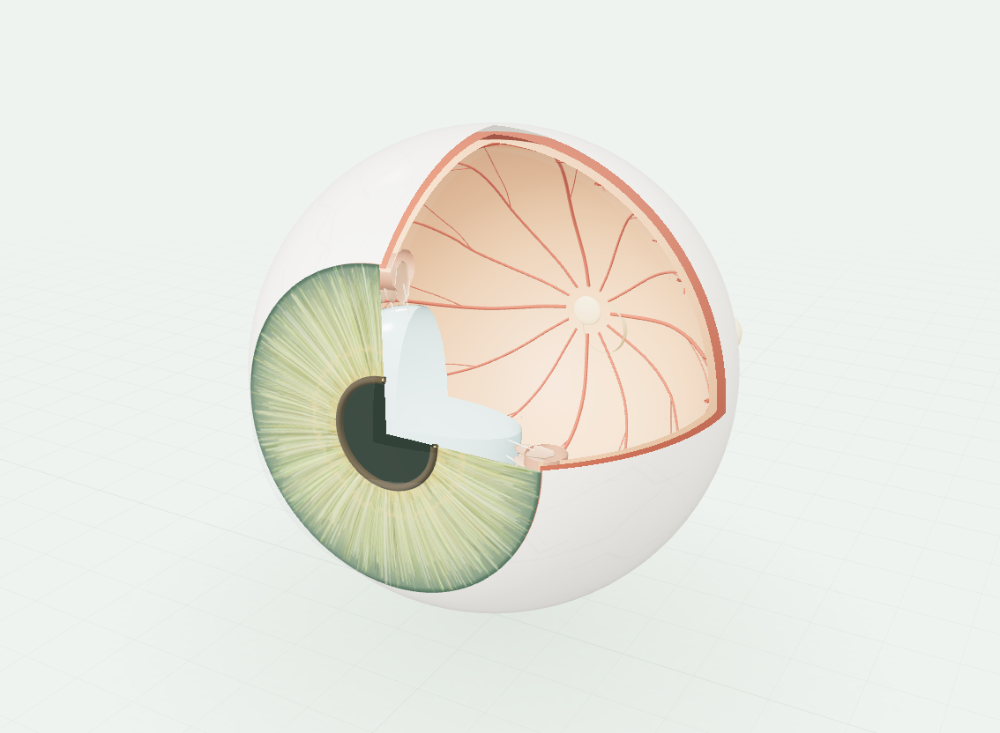

*图 27：本次浏览器测试通过真实下载事件保存的模型截图。与图 1 比较：背景网格在 Canvas 中，所以保留；HTML 标签、工具和侧栏不在 Canvas 中，所以不包含。*

这不是 GLB 导出，也不是整个网页截图。要保存完整界面可用浏览器截图；要保存几何资产需要另一条模型导出流程，当前按钮没有做这件事。

### 17.3 文档阅读与 CSS 的最小地图

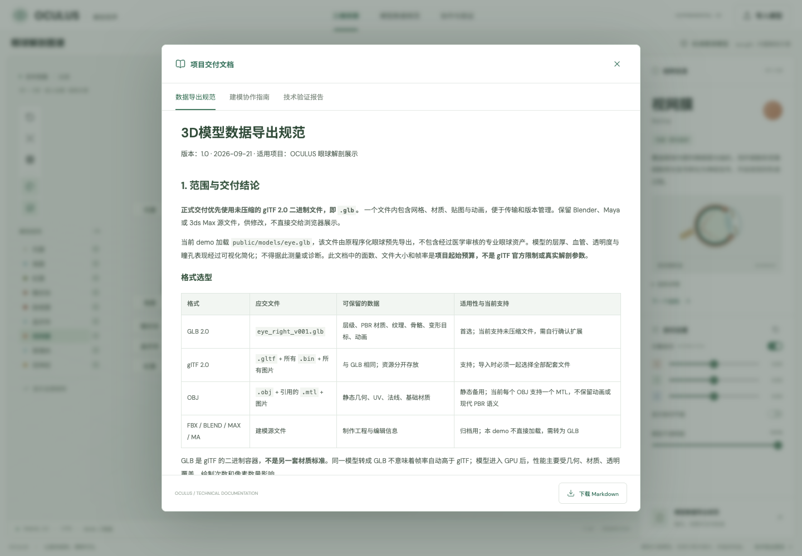

*图 28：点击顶部“模型数据规范”打开现有文档弹窗。本教程从 README/Markdown 预览阅读，没有新增网站标签页。*

`openDocument(name)` 按 documents 映射请求静态 Markdown → `marked.parse()` → 写入 dialog。递增 request 编号防止快速切换时旧响应覆盖新文档；这不是取消旧网络请求。这里只处理仓库受控文档，Marked 不替不可信 HTML 做安全清洗，不能直接套用到用户上传文稿。

CSS 的阅读顺序只需记住：主题与通用控件 → 主工作区/Canvas 叠层 → 图层与标签 → 侧栏/弹窗 → 响应式 → 文件末尾覆盖规则。检查最终样式用浏览器 Computed，不只看第一个同名选择器。

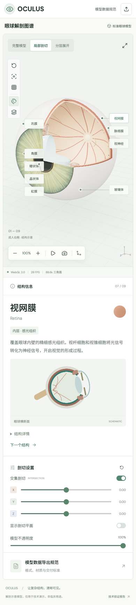

*图 29：390×844 视口的完整页面截图，小屏侧栏下移、图层面板初始折叠。它证明该视口布局，不等于实体手机性能测试。*

响应式主要断点为 1550、1150、860、560px；屏幕变化时 Three.js 同步容器尺寸，CSS 不改变模型坐标。`prefers-reduced-motion` 规则减少 CSS 过渡，不会自动关闭用户开启的三维动画。

<a id="practice"></a>
## 18. 从零搭建路线与动手练习

### 18.1 将第 4 节小球换成默认眼球

只在练习文件修改：删除创建小球的 geometry、material、mesh 三行和 `scene.add(mesh)`，增加下面的导入与加载。其它相机、光照、尺寸和循环保留。

**教学简化，可在第 4 节练习中运行：**

```js
import { loadEye } from '/src/eye.js';

const model = await loadEye('/models/eye.glb');
scene.add(model.root);
```

这是开发服务下的路径，只用于隔离练习，不是生产子目录路径方案。你会看到完整眼球，但颜色、环境和视角不必与正式页面完全一致，因为还没复现 Viewer 的全部设置。

接着练习一个平面：

```js
renderer.localClippingEnabled = true;
const plane = new THREE.Plane(new THREE.Vector3(-1, 0, 0), 0);
for (const surface of model.materials) {
  surface.clippingPlanes = [plane];
  surface.needsUpdate = true;
}
```

仍是**教学简化**：只有单轴，无页面滑块、无 CPU 拾取过滤。要继续扩展，先接两个原生控件调整 plane.constant 和 group.visible，再回读生产代码中的统一状态方法，不要从一开始复制 300 行页面模板。

### 18.2 建议按阶段完成，而不是一次实现全部

| 阶段 | 加入什么 | 验收点 |
| --- | --- | --- |
| 1 | Scene、Camera、Renderer、小球、灯 | 页面有非空三维画面 |
| 2 | OrbitControls、ResizeObserver | 能旋转缩放，改变宽高不拉伸 |
| 3 | GLTFLoader / loadEye | 读取实际资产，有九个组织组 |
| 4 | 平面与材质剖切 | plane.constant 改变可见区域 |
| 5 | Group 显隐与材质高亮 | 不重载模型也能改变结构表现 |
| 6 | Raycaster + id | 点击有效表面能找到正确结构 |
| 7 | 标注投影与联动 | 标签跟随镜头，文字对应 id |
| 8 | 外部导入、动画和清理 | 成功替换、失败保留、旧资源释放 |

### 18.3 在当前开发页做五个可撤销实验

先确认开发页加载完成，浏览器控制台存在 `window.__atlas`。以下只临时改运行状态，不改源码；每组实验后刷新恢复。

**实验 A：先证明它是一棵对象树。**

```js
const atlas = window.__atlas;
console.table([...atlas.model.groups].map(([id, group]) => ({ id, type: group.type, children: group.children.length })));
console.assert(atlas.model.groups.size === 9, '内置眼球应有九组');
```

观察一个组织是否包含多个 Mesh。不要用 Scene 的 child 数量代替组织数量，因为 Scene 里还放着灯光和网格。

**实验 B：观察平面方程。**

```js
const atlas = window.__atlas;
atlas.planes[0].constant = 0.75;
console.assert(atlas.planes[0].constant === 0.75, 'X 平面已移动');
```

观察缺口变化。此实验没有触发页面 input，因此滑块数值不会跟着改：它验证的是“对象状态和 UI 不是自动双向绑定”。

**实验 C：验证 all axes off。**

```js
const atlas = window.__atlas;
atlas.state.axes = [false, false, false];
atlas.applyClipping();
console.assert(atlas.model.materials.every(surface => surface.clippingPlanes.length === 0), '全轴关闭时无材质切面');
```

预期缺口消失，而模型仍在。然后刷新，别在 UI 与内部状态不同步时继续判断其它操作。

**实验 D：验证展开不会累计偏移。**

```js
const atlas = window.__atlas;
atlas.setMode('exploded');
const firstPosition = atlas.model.groups.get('cornea').position.clone();
atlas.setMode('exploded');
console.assert(firstPosition.equals(atlas.model.groups.get('cornea').position), '重复展开位置不应累加');
```

**实验 E：验证透明度能恢复原值。**

```js
const atlas = window.__atlas;
const originalOpacity = atlas.model.materials.map(surface => surface.opacity);
atlas.setOpacity(0.5);
atlas.setOpacity(1);
console.assert(atlas.model.materials.every((surface, index) => surface.opacity === originalOpacity[index]), '原始透明度应恢复');
```

不同实验块用相同 `const atlas` 名称时，若控制台拒绝重复声明，刷新后再执行。操作期间不要手工 dispose 当前正在显示的模型，否则会制造与教学目标无关的生命周期错误。

### 18.4 用现有测试资产练习导入

运行 `npm run test:browser` 后，`test-results/` 中会生成 fixture 文件：

1. 导入 `fixture.glb`：应有两个图层、内嵌贴图和动画面板。
2. 同选 `fixture.gltf`、`fixture.bin`、`fixture.png`：应显示等价模型。
3. 同选 `fixture.obj`、`fixture.mtl`、`fixture.png`：应显示静态模型，无资产动画面板。
4. 故意只选 `fixture.gltf`：应报告缺附件且保留当前模型。
5. 恢复示意模型：九组图层、固定标签和二维示意图重新出现。

不要把 fixture 当成正式交付模型。它的几何、材料和动画只是为了使兼容性测试可重复。

<a id="verification"></a>
## 19. 测试、排错与部署

### 19.1 三个验证脚本如何工作

| 脚本 | 编写方式与输入输出 | 已覆盖范围与边界 |
| --- | --- | --- |
| `check.mjs` | Node 内置 assert；读取 GLB、导入生产函数，失败以非零状态退出 | 默认 GLB 格式/九组/内嵌纹理、文件上限与附件规则、标注 id、剖切数学；不启动 WebGL |
| `browser-check.mjs` | Playwright 打开开发页，观察 `__atlas` 与画布像素，操作 UI，生成并导入测试资产 | 相机、剖切、图层、标签、PNG、文档、三格式、动画、失败回退、多视口；输出 PNG 与 JSON |
| `deploy-check.mjs` | 构建后启动临时 preview 或访问指定 BASE_URL，不依赖开发调试对象 | 子目录 JS/CSS/GLB、画面、九标注、文档和首页链接；不是全部导入交互测试的替代品 |

`check.mjs` 使用 `EyeViewer.prototype.isClipped.call(minimalViewer,point)` 执行生产方法，用最小 state/planes 避免创建 WebGL，并非复制一套剖切算法来“自证正确”。

浏览器测试中的 Node 代码与 `page.evaluate()` 的页面代码有边界：不能直接在页面回调中读取任意 Node 变量，要通过参数传入可序列化数据；二进制测试资产用 base64 回传，再由 Node 写盘。

### 19.2 推荐执行顺序

```bash
npm test
npm run test:browser
npm run build
npm run build -- --base=/Visual3D/
npm run test:deploy
```

第二条需要先启动开发服务，默认使用系统 Google Chrome；其它端口设置 `BASE_URL`。没有系统 Chrome 时可安装测试浏览器并选择它：

```bash
npx playwright install chromium
BROWSER_CHANNEL=chromium npm run test:browser
```

`test:browser` 使用开发调试入口和源码路径，不能把生产 preview 当成同一套测试目标。`test:deploy` 的默认 `DEPLOY_BASE` 是 `/Visual3D/`，应与构建参数一致。

构建可能提示较大的 JS chunk，要区分警告和失败。测试通过证明其断言覆盖的场景，不证明所有专业模型、真实手机、超大贴图或医学内容都已验证。

### 19.3 常见问题，按数据流定位

| 现象 | 先检查 |
| --- | --- |
| 只有 UI，没有眼球 | GLB 请求是否成功、九组约定、WebGL 2、容器尺寸、控制台错误 |
| 一片黑或非常暗 | 灯光/环境是否存在、材质类型、相机是否在模型内部、贴图与曝光 |
| 改相机 aspect 没效果 | 是否调用 updateProjectionMatrix，Canvas 是否同时 resize |
| 滑块变化但不切 | 是否 section、轴是否启用、renderer.localClippingEnabled、材质是否配置切面 |
| 全轴关闭却全部隐藏 | CPU 判断是否缺少非空数组保护 |
| 切掉的区域仍能点到 | Raycaster 结果是否经过 isClipped 过滤 |
| 选一个 Mesh，其它也高亮 | 是否共享材质、导入路径是否克隆材质 |
| 标签飘移 | 局部/世界坐标是否混用，分组是否添加了未考虑的旋转/缩放 |
| 隐藏父组仍被点击 | 是否检查整个父级链，而不仅是命中 Mesh.visible |
| 模型导入后极大/极小 | 包围盒与归一化层级、原节点动画是否覆盖了展示变换 |
| 缺贴图 | 是否同时选择附件、唯一文件名、远程引用是否被拒绝、图片能否解码 |
| 动画列表有内容但不动 | playing 开关、mixer.update、轨道绑定根与节点名 |
| 导入动画后位置突然变 | 是否误改原始节点居中，而不是通过父组归一化 |
| 图层仍显示旧模型 | 替换后是否 renderLayers 并选择新 entries 的 id |
| 重复替换后资源占用增长 | 旧动作、材质/纹理、Blob URL 是否各自清理，Viewer 长期资源是否误重复创建 |
| 找不到 __atlas | 是否生产环境、默认加载是否成功 |
| 修改生成器后页面没变 | 页面加载的是旧 GLB；生成器不属于启动链路 |
| PNG 没有标签和侧栏 | 正常：截图按钮只保存 WebGL Canvas |

### 19.4 部署只需理解静态资源前缀

工作流 `.github/workflows/deploy.yml` 在 main 推送或手动触发时：检出 → Node 22 → 安装 → 逻辑检查 → 按 Pages base 构建 → 安装测试浏览器 → 检查构建 → 上传 dist → 发布。

当前模型、文档与首页链接使用 `BASE_URL`，解决仓库站点在子目录中的路径问题。只有 dist 被发布，不上传 node_modules 和测试产物。教程位于 public，因此文档与配图会复制到构建目录；Markdown 仍是 Markdown，不会自动变成新增网站页面。

本任务没有新增部署、环境变量或 Vercel 配置。若以后另行选择 Vercel，建议先安装 CLI `npm i -g vercel` 以使用 deploy、logs 和需要时的 env pull；当前教程不需要它。

<a id="index"></a>
## 20. 完整覆盖索引、配图来源与参考

### 20.1 自有文件覆盖索引

| 文件 | 本文定位 | 阅读目标 |
| --- | --- | --- |
| `index.html` | 3、5 | 挂载点与 module 入口，不必背 HTML 模板 |
| `package.json` | 2、19 | scripts、依赖角色、type=module |
| `package-lock.json` | 2 | 可重复安装；不逐行讲机器生成依赖树 |
| `src/main.js` | 5、10～15、17 | 初始化、全部事件、回调与错误路径 |
| `src/viewer.js` | 7～13、15、17 | 构造与所有方法：resize/resetCamera/zoom/applyClipping/isClipped/setMode/select/setOpacity/updateAnnotations/replaceModel/screenshot |
| `src/eye.js` | 6、13、15 | eyeAnnotations、loadEye、disposeModel |
| `src/import-model.js` | 14 | validateFiles、loadModel、三格式与失败清理 |
| `src/content.js` | 6、12 | anatomy 字段、drawDiagram 绘制顺序 |
| `src/style.css` | 17 | 叠层、标签连线、断点、最终覆盖；简述，不展开 CSS 课程 |
| `scripts/eye-source.js` | 16 | randomGenerator/irisTexture/scleraTexture/createEye 及 add/shell；全部组织几何 |
| `scripts/export-eye.mjs` | 16 | Node 与浏览器协作、导出、校验及覆盖风险 |
| `scripts/check.mjs` | 19 | 最小逻辑检查与默认资产验证 |
| `scripts/browser-check.mjs` | 18、19 | 测试资产生成、真实交互与截图 |
| `scripts/deploy-check.mjs` | 19 | 不依赖开发调试入口的生产检查 |
| `public/models/eye.glb` | 6、16 | 节点、几何、材质、纹理与默认资产约定 |
| `public/docs/3D模型数据导出规范.md` | 6、14、16 | 专业资产交付格式、分组、压缩与默认资产对接 |
| `public/docs/建模需求与协作流程.md` | 20 | 建模端/前端如何试交、验收和反馈，不是运行时依赖 |
| `public/docs/技术验证报告.md` | 19、20 | 历史测量、验证边界与局限；不把旧数字当本次测量 |
| `public/docs/项目结构与新手入门.md` | 全文 | 本教程，README 的学习入口 |
| `public/docs/assets/tutorial/` | 全文配图 | 本次新增说明图、源码截图和真实运行图 |
| `.github/workflows/deploy.yml` | 19 | 自动检查、子目录构建与 Pages 发布 |
| `.gitignore` | 3、18 | 忽略依赖、构建结果、测试结果和本地工具状态 |
| `README.md` | 2、19 | 项目操作入口、运行命令、边界与部署说明 |

### 20.2 功能覆盖自查

- 渲染基础：场景树、透视相机、环境与灯光、材质、纹理、网格、示意阴影、DPR、ResizeObserver、渲染循环。
- 三维操作：旋转/平移/缩放、三预设视角、键盘、自动旋转、三展示模式、三轴与交并集、helpers、重置剖切、透明度、线框。
- 结构联动：图层选择/显隐/全部显示、射线过滤、高亮、下一结构、九标签投影/显隐/避让、方向标、二维示意图与文本。
- 模型流程：默认 GLB、三种导入格式、MTL/贴图、输入上限与失败处理、归一化、动画选择/播放/暂停、替换/恢复、资源生命周期。
- 辅助边界：全屏、Canvas PNG、统计、文档读取/下载/切换、错误提示、移动布局、WebGL 上下文丢失、测试与部署。
- 离线制作：随机纹理、九组几何、UV、曲线细管、合并几何、GLB 导出与校验。

### 20.3 配图与验证记录

- 图 1、9、11、13～17、20～21、24～25、28～29：本次打开当前本地开发页后采集；桌面 1440×1000，移动端为 390×844 视口的全页截图。图 1 仅额外添加教学编号。
- 图 3：独立练习 HTML 的真实画面；图 27：本次浏览器测试下载的 Canvas PNG。
- 图 2、4、6～7、10、18、22：根据源码流程绘制的 SVG 说明图，不冒充产品截图或真实几何。
- 图 5、8、12、19、23、26：当前源码摘录排版后截屏，文件名、起止行号与基线可见；不是代码编辑器主题截图，也未替换源码内容。
- 本次浏览器回归输出时间为 `2026-09-21T09:21:49.071Z`，Chrome 153，桌面 DPR 1；默认资产校验、三格式校验与真实导入、九标注、相机、剖切、图层、文档、PNG 和错误回退均通过。测试输出保存在忽略的 `test-results/`。
- 本次还通过 `npm test`、普通构建、`/Visual3D/` 子目录构建与 `test:deploy`；构建保留已有的 JS chunk 超过 500 kB 提示，没有为文档任务调整业务打包。
- 第 4 节小球、18.1 节眼球加载及单平面练习均在隔离目录验证为非空画面，加入剖切后像素发生变化；18.3 节五项状态实验通过。29 张配图、20 个目录锚点和本地文档链接均检查通过，构建产物中的配图与源文件一致。
- 性能受设备、浏览器前后台和采样条件影响。此处不复写历史技术报告的性能结论，不把截图中的数字推广到其它机器。

### 20.4 官方资料与继续阅读

查询 API 时以安装的 r186 为准：`node_modules/three/src/` 和 `examples/jsm/` 是当前依赖实际运行的实现。在线文档会更新，阅读时核对版本，尤其是附加模块导入路径、渲染器与颜色空间相关 API。

| 官方资料 | 重点查什么 |
| --- | --- |
| [Three.js 文档首页](https://threejs.org/docs/) | Scene、Object3D、Group、Mesh、Geometry、Renderer 的关系 |
| [PerspectiveCamera](https://threejs.org/docs/pages/PerspectiveCamera.html) | fov、aspect、near/far、更新投影矩阵 |
| [Material](https://threejs.org/docs/pages/Material.html) | clippingPlanes 的世界空间、负侧、clipIntersection、透明与深度写入 |
| [Plane](https://threejs.org/docs/pages/Plane.html) | 法线、constant、distanceToPoint |
| [Raycaster](https://threejs.org/docs/pages/Raycaster.html) | setFromCamera、递归求交与命中结果 |
| [OrbitControls](https://threejs.org/docs/pages/OrbitControls.html) | target、阻尼、距离限制与 update |
| [GLTFLoader](https://threejs.org/docs/pages/GLTFLoader.html) | loadAsync/parseAsync、scene、animations 与解码器配置 |
| [AnimationMixer](https://threejs.org/docs/pages/AnimationMixer.html) | clipAction、update、stopAllAction、uncacheRoot |
| [glTF 2.0 规范](https://registry.khronos.org/glTF/specs/2.0/glTF-2.0.html) | 节点、缓冲、材质、纹理与动画的文件表达 |

交付专业资产前，再读 [3D 模型数据导出规范](3D模型数据导出规范.md)、[建模需求与协作流程](建模需求与协作流程.md)；需要辨别“实现了”和“测过了”的差别时，读 [技术验证报告](技术验证报告.md)。

最后记住两条链：

```text
页面运行：HTML → main.js → loadEye(GLB) → model → EyeViewer → 每帧 render
用户操作：事件 → 改 Three.js 状态 → 下一帧画面 → 回调/投影同步页面
```

理解这两条链，再逐步学习材质、几何和动画，比一开始记住所有 Three.js 参数更有效。
